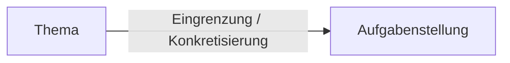

# Exposé

Definition von 

- Gegenstand und Motivation
- Problemstellung
- Zielsetzung
- Aufgabenstellung und 
- Arbeitspaketen und Fragestellungen
- Review

In einem [[Exposé]] geht es darum, die Planung und Konzeption eines wissenscahftlichen Schreibprojekts festzuhalten. Es gibt z.B. Aufschluss über das anvisierte Theme, die Fragestellung, Zielsetzung, Vorgehensweise, Daten- und Literaturgrundlage. Funktionen sind:

- eigene Orientierungshilfe bzgl. inhaltliche und zeitliche Realisierbarkeit / Umsetzbarkeit, disziplinäre Angemessenheit
- Nachvollziehbarkeit für andere Personen

> [!Info]  
> Das [[Exposé]] ist ein Zwischenschritt von der Idee zum Text. Es soll von vornherein Weichen stellen und kann Irrwege oder Rückschritte im [[Schreibprozess]] verhindern!

![[Pasted image 20240318141757.png]]

### Zur Entwicklung Einer Aufgabenstellung

Die Aufgabenstellung gibt den konkreten Arbeitsauftrag vor und bildet den Roten Faden Ihrer Arbeit. **Größere Änderungen der Aufgabenstellung sollten sie immer mit Ihren Fachlehrenden absprechen.**

> [!Tip]
> - Sie können versuchen ein Thema zu definieren, das Ihren persönlichen (fachlichen) Interessen entspricht.
> - Sie können beim Einlesen in die Fachliteratur nach interessanten Aspekten Ausschau halten, mit denen Sie Ihr Thema weiter eingrenzen bzw. spezifizieren.
> - Die Übungen [Dreischritt](https://moodle.ostfalia.de/pluginfile.php/673621/mod_page/content/18/Dreischritt.docx?time=1710507421924) und [Eingrenzungstabelle](https://moodle.ostfalia.de/pluginfile.php/673621/mod_page/content/18/Eingrenzungstabelle.docx?time=1710507430403) unterstützen Sie bei der Eingrenzung des Themas bzw. bei der Formulierung von Aufgabenstellung und Zielsetzung.

## Besprechung Des [[Exposé|Exposés]]

Gesprächstermin mit BetreuerIn zum [[Exposé]]. Dieses dauert etwa 10 Minuten. Nach dem Termin sollen die Änderungen im [[Exposé]] eingearbeitet werden und in Moodle hochgeladen werden.