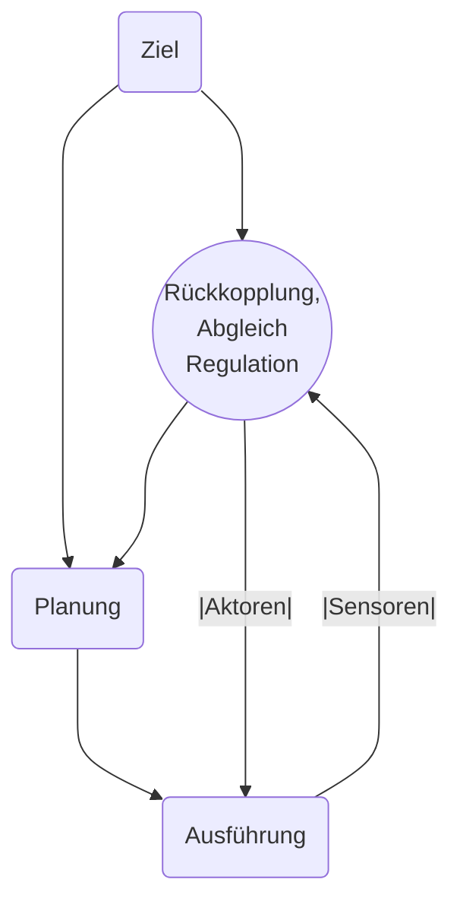

# Handlungsregulation

Siehe hier ein Ablaufschemata, wie eine Handlung bestimmt wird. Zielsetzung, Planung und Ausführung wird ständig durch eine Rückkopplung / einen Abgleich reguliert.  
Es gibt nun verschiedene Ebenen auf denen dieser *Abgleich* geschehen kann. Hacker (1996) unterscheidet hier zwischen drei Ebenen.

1. Bewusste Handlungen: Intellektuelle Regulationsebene; Auf dieser Ebene ist nur eine bewusste, intelletuelle Handlung gleichzeitig möglich
2. Routinehandlungen: flexible Handlungsmuster; Auf dieser Ebene sind nur wenige parallele Routinehandlungen möglich
3. Vollständig automatisierte Handlungen auf einer sensomotorischen Ebene; Bewusst wird nicht mehr eingegriffen