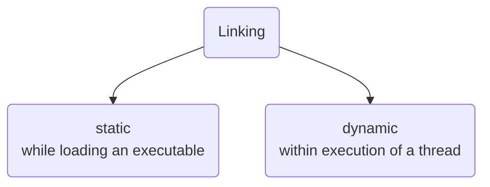
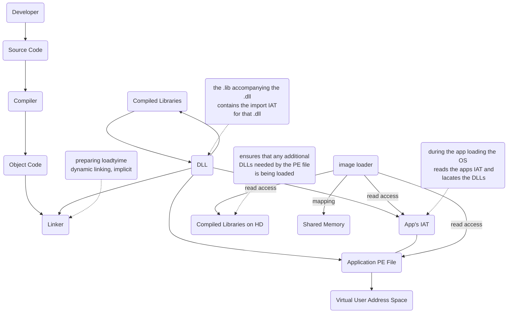

# Linking

## [[Linking|Static Linking]] Or Load Time [[Linking]]

## [[Linking|Dynamic Linking]]

Dynamic might be useful, when optimising imports of [[subsystem DLLs|DLLs]].

![[Pasted image 20231023171025.png]]