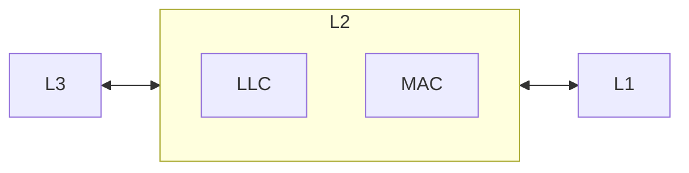

# Local Area Network

> [!Definition]  
> A [[Local Area Network|LAN]] is a bunch of hosts connected and administered together, connected by known [[Networking]] components, such as cables, access points, [[Hub|Hubs]] and [[Switch|Switches]].

The first [[Local Area Network|LANs]] were developed in the 1960s. They all belong the **one physical location** (home, building, office, school). A host might be a desktop machine, a server or a mobile device. Each host is identified by its own [[IP Address]]. There are two different deployment architectures for a [[Local Area Network|LAN]]:

1. Client / Server
2. Peer-To-Peer

## [[Data Link Layer|L2]] And [[Local Area Network|LAN]]

[[Data Link Layer|L2]] is the [[OSI reference model]] layer associated with a [[Local Area Network|LAN]] which is implemented via *[[Logical Link Control]]* or [[Media Access Control]].

## [[Local Area Network|LAN]], [[Networking|Networks]] And [[Router]]

![[Pasted image 20231113093419.png]]

Here, we see multiple [[Local Area Network|LANs]] connected via [[Router|Routers]], [[Hub|Hubs]] and [[Switch|Switches]]