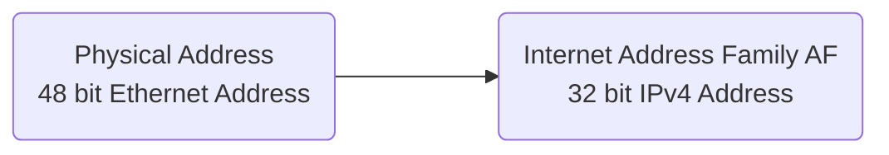

# Reverse Address Resolution Protocol

There also exists a reverse [[Protocol]] for [[Address Resolution Protocol|ARP]]. A physical machine in a [[Local Area Network|LAN]] can use [[Reverse Address Resolution Protocol|RARP]] to learn its [[IP Address]] from a gateway servers [[Address Resolution Protocol|ARP]] table in cache. When a new machine is set up, it can request the [[Reverse Address Resolution Protocol|RARP]] server on the [[Router]] to send its [[IP Address]]. If it exists, the [[Reverse Address Resolution Protocol|RARP]] server will return the [[IP Address]] to that machine which can store it for future use. 

