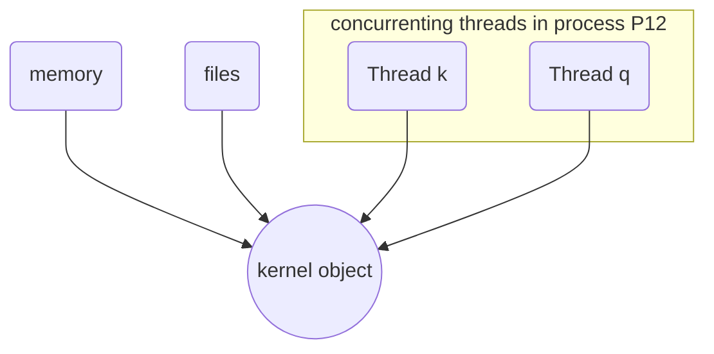
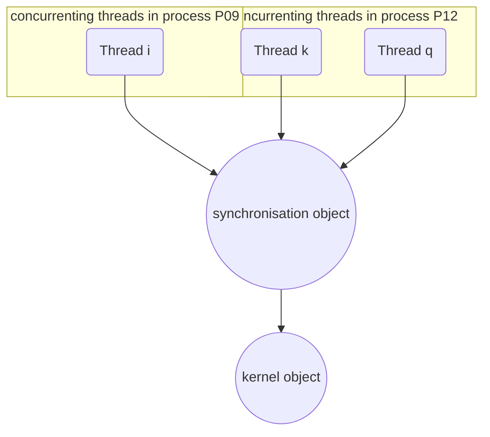

# Synchronisation Objects

Usually, several [[Thread|Threads]] are sharing the same [[Resources|resource]], or compete for them. We use a [[Synchronisation Objects|Synchronisation Object]] to manage access to [[Resources]] for multiple [[Thread|Threads]]. 

> [!Info]  
> read-only access to [[subsystem DLLs|DLLs]] requires no [[Synchronisation Objects]]

Serious problems may arise by a mixed read and write access to a [[Resources|resource]]. A *synchronization* is required in this case (called a *race condition*)! No controlled access to shared [[Resources]] means a read/write access.

Special [[Kernel]] objects, called [[Synchronisation Objects|Synchronisation Objects]] are used to manage [[Thread]] access to such shared [[Resources]]. We allow only one [[Thread]] access to some [[Resources|resource]] via [[Synchronisation Objects]] ([[mutual exclusion]]).  
Sections of code that access a non-shareable [[Resources|resource]] are called *critical sections*. To ensure correct code, only one [[Thread]] at a time can execute in a critical section.

> [!Example]  
> While one [[Thread]] is writing to a file, updating a database or modifying a shared variable, no other [[Thread]] can be allowed to access the same [[Resources|resource]].

The executive objects *[[Mutexes]]* and *[[Semaphores]]* are used for synchronization.