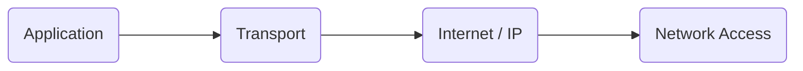

# User Datagram Protocol

> [!Definition]  
> [[User Datagram Protocol]] ([[User Datagram Protocol|UDP]]) is a [[Transport Layer]] [[Protocol]] to send messages from one [[Port Numbers|Port]] to another with a minimum of overhead.
> 
> - [[User Datagram Protocol|UDP]] is only transaction oriented (in contrast to [[TCP protocol|TCP]])
> - no connection means no [[Three-Way-Handshake]]
> - no reliable delivery
> - no data integrity
> - no ordered delivery

All of this makes [[User Datagram Protocol|UDP]] more appropriate for small amounts of transactional data as well as for time-sensitive processes.

- Retransmission means bigger [[Latency]]
- Handshaking for a connection means overhead

## Background

![[Pasted image 20231114081935.png]]

The [[User Datagram Protocol|UDP]] Header is way smaller than the [[TCP protocol|TCP]] header ($8$ vs. $20$ Bytes).

1. *Source [[Port Numbers|Port]]* is an optional [[Port Numbers|Port]] and might be used for a reply. If the source [[Port Numbers|Port]] is zero, it should not be used.
2. *Checksum* is also not mandatory. An all zero transmitted checksum value means that the transmitter generated no checksum. If the computed checksum is zero, it is transmitted as all ones.

![[Pasted image 20231113083338.png]]

## Where is [[User Datagram Protocol|UDP]] Used?

Live Streaming of audio or video: [[Packets]] loss is here to some extent OK (due to limitation of human sensory organs). Rather low [[Latency]] is essential. [[TCP protocol|TCP]] is better for Video on demand.

[[Application Layer|L7]] protocols or other tasks with low overhead requirements:

| Name | Detail |
| ---- | ---- |
| [[Simple Network Management Protocol]] ([[Simple Network Management Protocol\|SNMP]]) | [[User Datagram Protocol\|UDP]] [[Port Numbers\|Port]] 161 |
| DNS | [[User Datagram Protocol\|UDP]] [[Port Numbers\|Port]] 53 |
