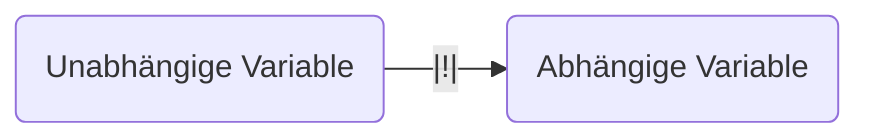

# Validität

Eine [[Wissenschaft|wissenschaftliche]] Studie ist valide, wenn das gemessen wird, was gemessen werden soll und wenn die Daten auch tatsächlich die Frage beantworten.

- Interne Validität: Können aus den Daten kausale Schlüsse gezogen werden?
- Externe Validität: Sind die Ergebnisse auch auf andere Situationen außerhalb der Studie übertragbar.

