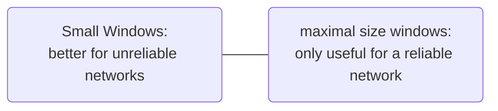

# Window Field

Maximum Window size is $2^{16} -1 = 65535$, meaning the size of bytes of buffer space (in bytes) a host (sender or receiver) has available for data it can deal with.  
The receiver governs the amount of data sent by the receiver. The receiving [[TCP protocol|TCP]] reports a *window* to the sending [[TCP protocol|TCP]]. What does the value in the [[Window Field]] tell the other side? It tells it how many bytes it is allowed to send before stop and wait for an acknowledgement. Default Window size is $4128$

Zero means "send no data". No [[Segment|Segments]] should be acceptable except ACK [[Segment|Segments]].

## Sliding Window

*Sliding Window* means that each communication partner might change the window size dynamically by, for example, reducing the size if a congestion is anticipated.  
Modern, fast networks can handle windows much larger than 65k ([[Request for Comments|RFC]] 1323).

> [!Definition]  
> The [[Window Field]] option multiplies the window's size value found in a [[TCP protocol|TCP]] header. The *scale factor* is carried in a new [[TCP protocol|TCP]] option, being sent only in a SYN [[Segment]]. A [[Window Field|Window Field Scaling]] option is a [[Segment]] without a SYN should be ignored.

With [[Window Field|Scaling]], the maximum window size increases to $2^{30} - 1 = 1073741823$ bytes or roughly $1$ GB.

> "If a [[TCP protocol|TCP]] receives a SYN [[Segment]] containing a [[Window Field|Window Scaling]] option, it sends its own [[Window Field|Window Scaling]] option in the SYN, ACK [[Segment]]."

\- [[Request for Comments|RFC]] 2323

![[Pasted image 20231113080411.png]]  
![[Pasted image 20231113080459.png]]

$3$ Bytes are used to indicate that the [[TCP protocol|TCP]] is prepared to do both send and receive [[Window Field|Window Scaling]]. It sends a *scale factor* to be applied to its receive window".

> [!Quote]  
> "Option is an offer, but not a promise."  
> "Both sides must send [[Window Field|Window Scaling]] options in their SYN [[Segment|Segments]] to enable [[Window Field|Window Scaling]] in either direction."

## Unknown Scaling Factor

In this stage, Wireshark does not see the [[Three-Way-Handshake]]. Therefore, this value may or may not be the true [[Window Field|Window Scaling]].

![[Pasted image 20231113080910.png]]
