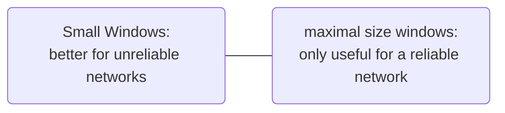

# Window Field

Maximum Window size is $2^{16} -1 = 65535$, meaning the size of bytes of buffer space (in bytes) a host (sender or receiver) has available for data it can deal with.  
The receiver governs the amount of data sent by the receiver. The receiving [[TCP protocol|TCP]] reports a *window* to the sending [[TCP protocol|TCP]]. What does the value in the [[Window Field]] tell the other side? It tells it how many bytes it is allowed to send before stop and wait for an acknowledgement. Default Window size is $4128$

Zero means "send no data". No [[Segment|Segments]] should be acceptable except ACK [[Segment|Segments]]