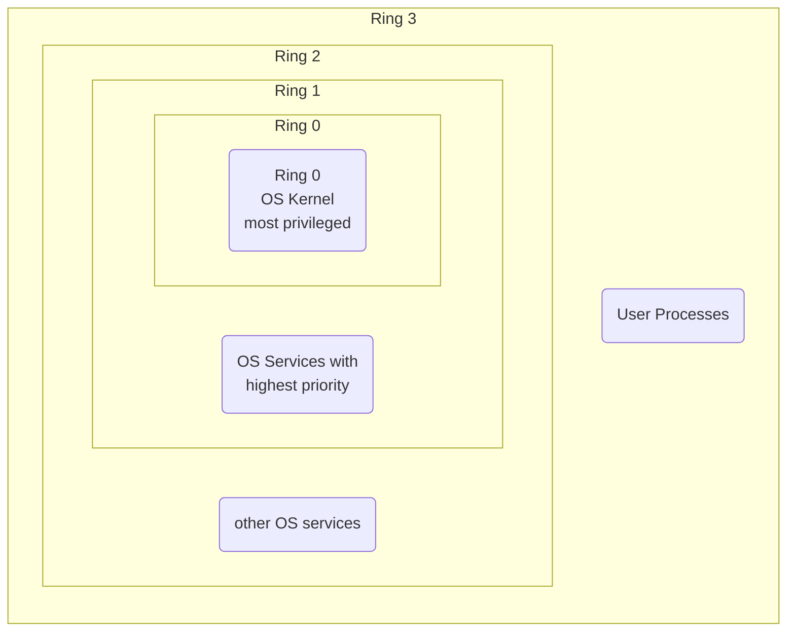

# Windows Architecture

![[Pasted image 20231020172322.png]]

See here an overview of the [[Windows architecture]]. This diagram is a basic view and doesn't show everything. For example, the [[Networking]] components are not shown. Also, none of the various types of [[Device Drivers]] are shown. Each [[OS service]] has its own private [[Process]] address space.

![[Pasted image 20231020195418.png]]

## Ring Mechanism

The x86-architecture introduces so-called *privilege levels* to support memory protection.

The Ring Mechanism lets the [[Operating System|OS]] and [[Central Processing Unit|CPU]] collaborate to realize memory segmentation. At any given time, an x86 [[Central Processing Unit|CPU]] is running in a specific *privilege level*, which determines what code can and cannot do. Most modern x86 [[Kernel|Kernels]] use only two privilege level (0 and 3). The [[Central Processing Unit|CPU]] privilege level is just related to the [[physical memory]] and has nothing to do with [[Operating System|OS]] users, whether root, admin, guest or regular user.  
All [[Kernel]] code runs in ring 0, regardless of the user on whose behalf the code operates. All user code runs in ring 3, regardless of the [[Operating System|OS]] user on whose behalf the code operates.  
Due to restricted access to memory and IO ports, [[User Application Space|User mode]] can do almost nothing to the outside without calling on the [[Kernel]]. It can't open files or send network packets or print the screen or allocate memory. All the *data structures* that control these tasks cannot be touched directly by user code so actually a user [[Process]] is running inside a *sandbox*, run by the [[Operating System|OS]] [[Kernel]]. The [[Kernel]] *starts* and later *tears down* the individual sandbox for each user [[Process]]. 

> [!Info]  
> This is why [[Windows]] 95 and 98 crashed so much, because important data structures were left accessible to [[User Application Space|User mode]] for compatibility reasons.