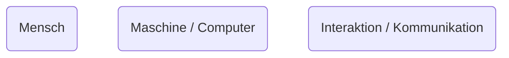

# Einführung

In diesem Kurs sollen die folgenden Fragen geklärt werden:

1. Wie kommunizieren Mensch und Maschine, bzw. Computer?
2. Warum ist das wichtig?
3. Wie entwirft man so etwas?

## Mensch Zu Mensch [[Kommunikation]]

Was für Arten von Kommunikationen gibt es? Betrachten wir die Mensch zu Mensch-Kommunikation. 

![[Pasted image 20240302162145.png]]

Wir unterscheiden hier zwischen drei Arten von Kommunikation:

- visuell
- akustisch
- taktil

## [[Kommunikation|Mensch zu Computer Kommunikation]]

![[Pasted image 20240302162401.png]]

Diese Form der [[Kommunikation|Kommunikation]] ist *asymmetrisch*. Unterschiedliche Medien können für jede Richtung benutzt werden.

## [[Ergonomie]]

*ergon*: griechisch für Arbeit oder Werk  
*nomos*: griechisch für Regel oder Gesetz.

> [!Definition]  
> *[[Ergonomie]]* ist damit die Lehre von der menschlichen Arbeit, ihrer Beschreibung, Modellierung und Verbesserung.

[[Ergonomie]] ist auch die Lehre von der wechselseitigen Anpassung von Mensch und Maschine. 

# Historie

Hier 9:15