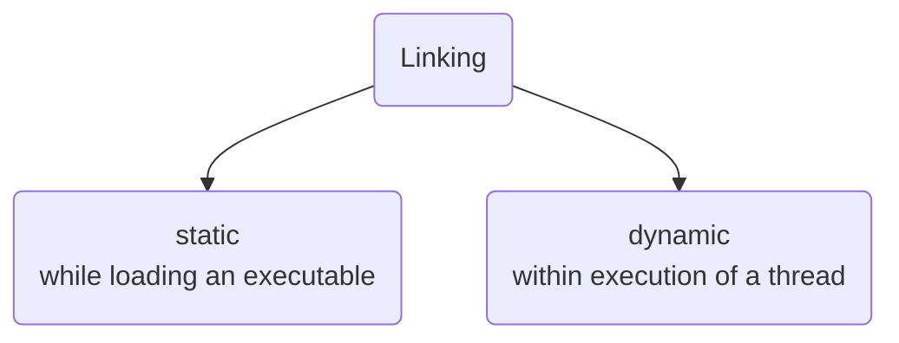
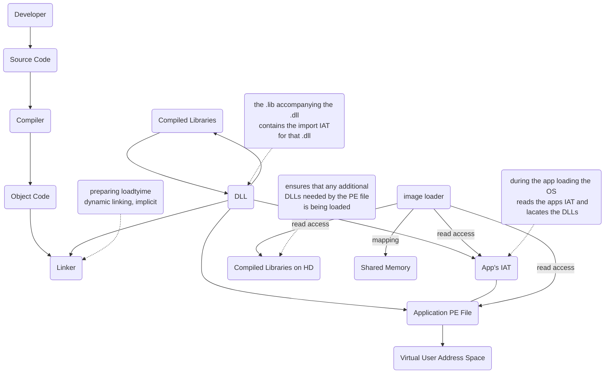
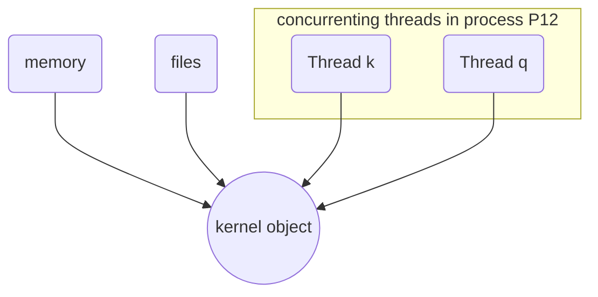
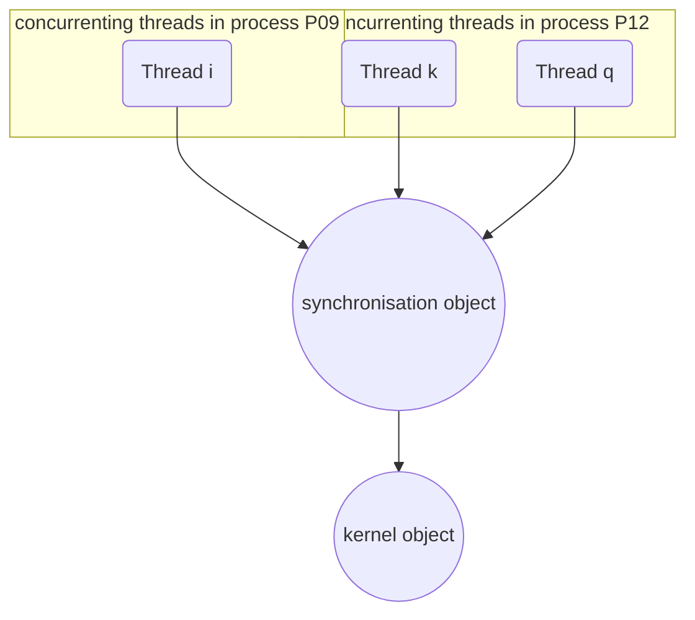

# Loader and Linking, Process and Thread Management

## [[Image Loader]]

A [[Process Object]] cannot be executed. Rather, the [[Thread|Threads]] which are part of that [[Process]] are being executed. Within an image file, there is an array of data structures, one per imported [[subsystem DLLs|DLL]]. The [[Import Address Table]] provides a list of all [[subsystem DLLs|DLLs]] and functions that the executable uses.

## [[Import Address Table]]

> [!Definition]  
> The [[Import Address Table]] ([[Import Address Table|IAT]]) is a call table containing the name of the imported [[subsystem DLLs|DLLs]] and an array of function pointers within each [[subsystem DLLs|DLL]]. 
 
[[Import Address Table|IAT]] specifies the addresses of the [[subsystem DLLs|DLL]] functions imported by an image file.

![[Pasted image 20231023074939.png]]

See here, as an example, used [[subsystem DLLs|DLLs]] by *Notepad++*:

![[Pasted image 20231023075327.png]]

## Structure of a [[Portable Executable]]

There are multiple "sections" in each [[Portable Executable|PE]]. 

1. `.text` Represents the code.
2. `.rsrc` Is used by binary data, which is part of that [[subsystem DLLs|DLL]]
3. Multiple data-sections are, for example, used for constants, variables and so on. For each type of data, another section is used. 

![[Pasted image 20231023075426.png]]

## [[Image Loader]]

All [[Process|Processes]] are subject to the same behaviour (*with some minor differences*). The [[Image Loader]] initializes the [[User Application Space|User mode]] state for the application, creating

- The initial [[Virtual Memory address space|VAS]]
- [[Thread|Threads]] (meaning code to be executed) and initialized static data and constants.
- Other [[Resources]], such an (icons, configs and images)
- [[subsystem DLLs|DLL]] related import and export tables ([[Import Address Table|IAT]] relevant data)

![[Pasted image 20231023165758.png]]

The [[Image Loader]] parses the **[[Import Address Table|Import Address Table]]** of the application to look for all [[subsystem DLLs|DLLs]] that are required. The [[Image Loader]] uses [[Sections|Section Objects]] to map executable images, [[subsystem DLLs|DLLs]] and other [[Resources]]. The [[Image Loader]] recursively parses the [[Import Address Table|IAT]] of each [[subsystem DLLs|DLL]], followed by parsing the export tables of the [[subsystem DLLs|DLLs]] to make sure that each needed function is being loaded. This is important when certain [[subsystem DLLs|DLLs]] use another function from other [[subsystem DLLs|DLLs]].

## [[Module DB]]

> [!Definition]  
> Loaded [[subsystem DLLs|DLLs]] and the primary executable of a [[Process]] are called *[[Module DB|Modules]]*.

The [[Image Loader]] maintains a list of all [[Module DB|Modules]] in the [[Module DB|Module Database]] to check for the presence of a [[subsystem DLLs|DLL]] function. The [[Image Loader|Ldr]] looks at the [[Module DB|Module Database]]. If a [[subsystem DLLs|DLL]] with the same [[Module DB|Module]] name if already loaded in memory, the system uses the loaded [[subsystem DLLs|DLL]], no matter which directory it is in.

### Known [[subsystem DLLs|DLLs]]

There exist some *known [[subsystem DLLs|DLLs]]*, meaning they have already been loaded at [[Operating System|OS]] startup. That's why there is no need to search and load them again! 

![[Pasted image 20231023082417.png]]

Some [[subsystem DLLs|DLLs]] are on the list of *known [[subsystem DLLs|DLLs]]* for the version of [[Windows]] on which the application is running. The system uses it (loaded) copy of the known [[subsystem DLLs|DLL]] instead of searching for it. The *known [[subsystem DLLs|DLLs]]* dependent [[subsystem DLLs|DLLs]] are considered as well.

### Searching for a [[subsystem DLLs|DLL]]

Where can one locate a [[subsystem DLLs|DLL]] on a secondary storage device? The [[Image Loader|Ldr]] examines these related directories when searching for a [[subsystem DLLs|DLL]]:

1. The directory from which the application was launched.
2. The native [[Windows]] system directory (e.g. `C:\Windows\System32`)
3. The 16-Bit [[Windows]] system directory (e.g. `C:\Windows\System`)
4. The [[Windows]] directory (e.g. `C:\Windows`)
5. The current directory at launch time
6. Any directories specified by the `%PATH%` environment variable

The [[Image Loader|Ldr]] then creates a *loader data table entry* for this [[subsystem DLLs|DLL]] and inserts it into the database. After each [[subsystem DLLs|DLL]] is loaded, the [[Image Loader|Ldr]] continues to parse the [[Import Address Table|IAT]] for further [[subsystem DLLs|DLLs]] to be imported. The *[[subsystem DLLs|DLL]] search path* is recomputed for each subsequent [[subsystem DLLs|DLL]] load operation.

## [[Linking]]



### [[Linking|Static Linking]] Or Load Time [[Linking]]



### [[Linking|Dynamic Linking]]

Dynamic might be useful, when optimising imports of [[subsystem DLLs|DLLs]].

![[Pasted image 20231023171025.png]]

## [[Windows Application Programming Interface]]

> [!Definition]  
> The [[Windows Application Programming Interface]] (Win API) is the [[User Application Space|User mode]] system programming interface for the [[Windows]] [[Operating System|OS]] family. The [[Windows Application Programming Interface|Win API]] consists of thousands of callable functions such as:
> 
> - Base Services
> - Component Services
> - [[Networking]]
> - Web Services
> - Graphics and Multimedia Services
> - Messsaging and Collaboration
> - User Interface Services

## [[Process|Processes]]

A *[[Process]] is a container* for a set of [[Resources]] used when executing the instance of the program. In this case [[Resources]] mean

- private [[Virtual Memory address space|Virtual Memory Address Space]]
- A list of open [[Handle|Handles]] (pointers) to various system [[Resources]]
- An access token to identify users, security groups, privileged, etc.
- A unique identifier, call a *process ID*
- A least one [[Thread]] of execution

### [[Process Object]]

The state of a running [[Process]] is represented by a dedicated data structure, called an executive [[Process]] structure `eprocess` in [[Kernel Address Space|KAS]]. Inside the [[Windows executive|Windows Executive]], the [[Object Manager]] encapsulates `eprocess` as a [[Process Object]].

![[Pasted image 20231023171159.png]]

`eprocess` Contains many attributes, relating to a [[Process]], such as [[Process]] ID, image filename, flags and counter. It points to a number of other related data structures, such as [[Thread|Threads]] (called `ethreads`). `eprocess` points to [[Process Environment Block|PEB]] in [[User Application Space|User mode]].

### [[Process Environment Block]]

> [!Definition]  
> [[Process Environment Block|Process Environment Block]] is a pointer to a data structure in [[User Application Space|User mode]]. It provides necessary data for [[User Application Space|User mode]] applications, e.g. a list of all [[Module DB|Modules]] that have been loaded by a [[Process]].

## [[Thread|Threads]]

> [!Definition]  
> A [[Thread]] is the basic unit to which the [[Operating System|OS]] allocates [[Central Processing Unit|CPU]] time. Each [[Process]] is started with a single [[Thread]], often called the *primary Thread*, but can create additional [[Thread|Threads]] from any of its [[Thread|Threads]]. Without at least one [[Thread]] within a [[Process]], it cannot run.

1. From our point of view, a [[Thread]] is essentially a `main()` [[Function Call]], which calls other functions. Each of them may call other functions as well. 
2. From a [[Central Processing Unit|CPU]]s perspective, the contents of a set of [[CPU register]]s representing the state of the processor is called a [[Thread]]. 

### [[CPU register]]

A register is a core part of a [[Central Processing Unit|CPU]]. Internal [[Central Processing Unit|CPU]] memory may hold a [[Central Processing Unit|CPU]] instruction, a storage address or any kind of data (e.g. a bit sequence or individual characters). Much of the instruction set of a [[Central Processing Unit|CPU]] will be tailored for working against registers, rather than [[physical memory]]. Accessing a Register typically requires just a few clock cycles.

## [[Function Call]]

> [!Definition]  
> A function call is a [[Expression]] that passes control and arguments (if any) to a function and has the form:
> ```
> expression(argument-list)
> ```

### [[Expression]]

> [!Definition]  
> An [[Expression]] is a function name or evaluates to a function address.

### What Else Belongs to a [[Thread]]?

We have two [[Stack|Stacks]] for the [[Thread]]. One to use while executing in [[Kernel Address Space|Kernel Mode]]. The other for executing in [[User Application Space|User mode]].  
How can we identify a [[Thread]]? A unique identifier, also called a *[[Thread]] ID*.

### [[Stack]]

> [!Definition]  
> A [[Stack]] is a region in [[physical memory]] being dedicated to a [[Thread]] to save the data and pointers maintained during the execution of functions in that [[Thread]].

### [[Threads Local Storage]]

 A private storage area called the [[Threads Local Storage|Threads Local Storage]] ([[Threads Local Storage|TLS]]) is for 

- use by subsystems
- use by run-time libraries
- use by [[subsystem DLLs|DLLs]]

### [[Thread Context]]

A [[Central Processing Unit|CPU]] often needs to execute multiple [[Thread|Threads]] at the same time, though only one can be handled at a time. [[Thread|Threads]] therefore only have a certain processor time to be executed. How does this handling work? All data in a [[Thread]]'s [[CPU register|Registers]], [[Stack]] and private storage build the [[Thread Context|Thread Context]]. This specific realization depends on the processor architecture, because the hardware realization of a [[Thread Context|Thread Context]] is different for each machine architecture that [[Windows]] runs on. 

> [!Info]  
> The [[Thread|Threads]] of a 32-Bit application running on a 64-Bit version of [[Windows]] will for example contain both 32-Bit and 64-Bit [[Thread Context|Thread Context]]s. `Wow64` will switch the application from running in 32-Bit to a 64-Bit mode when required.

## [[Multi-Threading|multi-threading]]

There is actually the option to execute multiple [[Thread|Threads]] at once. Nowadays, many [[Central Processing Unit|CPU]]s are indeed multi-[[CPU Core|Core]]. Thus, a [[Central Processing Unit|CPU]] with 4 [[CPU Core|Cores]] can execute 4 different [[Thread|Threads]] in parallel. This is called *[[Multi-Threading]]*.

### [[CPU Core]]

> [!Definition]  
> A [[CPU Core]] is a physical processing unit that can execute a single [[Thread]].

## [[Hyper-Threading]]

Introduced by Intel, *[[Hyper-Threading]]* is a hardware technology that allows more than one [[Thread]] to run on each [[CPU Core|Core]]. The [[Central Processing Unit|CPU]] allows two [[Thread Context|Thread Context]]s per physical [[CPU Core|Core]], i.e., one physical [[CPU Core|Core]] is transformed to two logical [[CPU Core|Cores]]. This improves the [[Central Processing Unit|CPU]] performance considerably.

## [[Idle Process]]

The *Idle Process* is a system [[Process]] with a specified task. This [[Process]] contains a single [[Thread]] `PID 0`. Each [[Central Processing Unit|CPU]] has its own dedicated idle [[Thread]]. Its purpose is to keep precise record of processor time when the [[Operating System|OS]] isn't executing other [[Thread|Threads]]. When no runnable [[Thread]] exists on a [[Central Processing Unit|CPU]], [[Windows]] dispatches that [[Central Processing Unit|CPU]]s idle thread. Idle shows indeed how much isn't being used by other [[Process|Processes]].

- The *Idle Process* has no real image
- The *Idle Process* has no [[User Application Space|User mode]] address space. 

The initial idle [[Thread]] and *idle process* structures are statically allocated before bootstrapping (initializing) the system to participate in bootstrapping the system, meaning the existence before the [[Process management|Process Manager]] and the [[Object Manager]] are initialized.

## [[System Worker Thread]]

The "System" [[Process]] `PID 4` is the container for a special kind of [[Thread]] that runs only in [[Kernel Address Space|Kernel Mode]], which is a [[Kernel Address Space|Kernel Mode]] [[Thread]]. During system initialisation, [[Windows]] creates several [[Thread|Threads]] in the *System process*, called [[System Worker Thread|System Worker Threads]], which exists solely to perform work on behalf of other [[Thread|Threads]] to perform operations that require system [[Thread Context]], such as 

- issuing and waiting for IO
- creating [[Object]]s
- polling a device
- writing dirty [[Pages]] to the [[Page File]] or mapped files by [[Memory Management|MemMan]]

By default, system Threads are owned by the System process, but a drive can create a [[System Worker Thread]] in any [[Process]]. However, most [[Thread|Threads]] use [[System Worker Thread|System Worker Threads]] instead.

## [[Synchronisation Objects]]

Usually, several [[Thread|Threads]] are sharing the same [[Resources|resource]], or compete for them. We use a [[Synchronisation Objects|Synchronisation Object]] to manage access to [[Resources]] for multiple [[Thread|Threads]]. 

> [!Info]  
> read-only access to [[subsystem DLLs|DLLs]] requires no [[Synchronisation Objects]]



Serious problems may arise by a mixed read and write access to a [[Resources|resource]]. A *synchronization* is required in this case (called a *race condition*)! No controlled access to shared [[Resources]] means a read/write access.



Special [[Kernel]] objects, called [[Synchronisation Objects|Synchronisation Objects]] are used to manage [[Thread]] access to such shared [[Resources]]. We allow only one [[Thread]] access to some [[Resources|resource]] via [[Synchronisation Objects]] ([[mutual exclusion]]).  
Sections of code that access a non-shareable [[Resources|resource]] are called *critical sections*. To ensure correct code, only one [[Thread]] at a time can execute in a critical section.

> [!Example]  
> While one [[Thread]] is writing to a file, updating a database or modifying a shared variable, no other [[Thread]] can be allowed to access the same [[Resources|resource]].

The executive objects *[[Mutexes]]* and *[[Semaphores]]* are used for synchronization.

### [[mutual exclusion]]

> [!Definition]  
> The concept of *[[mutual exclusion]]* refers to the guarantee that one, and only one [[Thread]] can access a particular [[Resources|resource]] at a time. 

[[mutual exclusion]] is a crucial concept is [[Operating System|OS]] development. A Waiting [[Thread]] is selected with regard to relevant [[Synchronisation Objects]]. Do not assume a first-in, first-out.

### [[Semaphores]]

> [!Definition]  
> A [[Semaphores|Semaphore]] object is a counter that maintains a count between $0$ and a specified maximum value.

Some [[Resources]] can support a limited number of users simultaneously (*shareable*). To allow some maximum number of [[Thread|Threads]] to access the [[Resources]] being protected by the [[Semaphores|Semaphore]], a counter data structure is used. The count is decremented each time a [[Thread]] completes a *wait* for the [[Semaphores|Semaphore]] object, and incremented each time a [[Thread]] *releases* the [[Semaphores|Semaphore]]. The state of a [[Semaphores|Semaphore]] is set to *nonsignaled* when its count is zero and *signaled* when its count is greater than $0$.

> [!Example]  
> An Application might place a limit in the number of windows that it created. Each window is managed by a dedicated [[Thread]]. A [[Semaphores|Semaphore]] is used with a maximum count equal to the window limit, decrementing the count whenever a window is created and incrementing it whenever a window is closed.
> 
> 1. Before creating a new window, i.e. a new [[Thread]], the application uses a specific [[Windows Application Programming Interface|Win API]] call to determine whether a [[Semaphores]] current count permits it to do so.
> 2. When the count is $0$ - indicating that the window limit has been reached - the wait function blocks execution of the window-creation code.

### [[Mutexes]]

> [!Definition]  
> [[Mutexes|Mutexes]] are synchronisation mechanisms used to serialise access to a [[Resources|resource]] (meaning exclusive usage).
>  

A [[Mutexes]] status is set to *signaled* when it is not owned by any [[Thread]] and *nonsignaled* when it is owned. Also called [[Mutexes|Mutant]] internally. Only one [[Thread]] at a time can own a [[Mutexes|Mutex]] object.

> [!Example]  
> For example, to prevent two [[Thread|Threads]] from writing to [[Shared Memory|Shared Memory]] at the same time, each [[Thread]] *waits* for ownership of a [[Mutexes|Mutex]] object before executing the code that accesses the memory. After writing to the [[Shared Memory]], the [[Thread]] *releases* the [[Mutexes|Mutex]] object. 
 
[[Thread|Threads]] in other [[Process|Processes]] can open a [[Handle]] to an existing named [[Mutexes|Mutex]] by specifying its name.  
What if a [[Thread]] terminated without releasing its ownership of a [[Mutexes|Mutex]] object? The [[Mutexes|Mutex]] object is considered to be *abandoned*. An *abandoned* [[Mutexes|Mutex]] object indicated that an error has occurred. Any shared [[Resources|resource]] being protected by that [[Mutexes|Mutex]] object is considered to be in an undefined state.

## [[Windows Registry]]

> [!Defintion]  
> The *[[Windows Registry|Registry]]* is a system-defined hierarchical data repository. Its data structure is in a tree format. The [[Operating System|OS]] stores and retrieves configuration data in it, such as 
> 
> - for applications
> - its own components

[[Kernel]] and user [[Process|Processes]] use the [[Windows Registry|Registry]]. The [[Windows Registry|Registry]] is one of the fundamental mechanisms in the [[Windows]] [[Operating System|OS]]. It is critical of the [[Operating System|OS]] management and config.

1. Within the initial phase of [[Operating System|OS]] booting and before initializing the [[Kernel]]: The bootloader reads configuration data and loads the list of boot [[Device Drivers]] into memory.
2. During the *[[Kernel]] boot process*, the [[Kernel]] reads settings that specify which [[Device Drivers|device drivers]] to load and how the [[Memory Management|Memory Manager]] and [[Process management|Process Manager]] configure themselves.
3. During *logon*, [[Operating System|OS]] components read per-user preferences from the [[Windows Registry|Registry]] such as desktop wallpaper, icon placement, which startup programs to launch and which files were most recently accessed.
4. During *app startup*, applications read systemwide settings as well as per-user settings, such as licensing data and a list of most-used recently accessed documents.

# Anki

A [[Process Object]] cannot be executed. (True or False) #flashcard
True. Rather, the [[Thread|Threads]] which are part of that [[Process]] are being executed.
<!--ID: 1706354045496-->


What data structure is meant when talking about an *[[Import Address Table|IAT]]*? #flashcard
[[Import Address Table]]
<!--ID: 1706354045498-->


What information does the [[Import Address Table]] contain? #flashcard 
- the name of imported [[subsystem DLLs|DLLs]] 
- an array of function pointers within each [[subsystem DLLs|DLL]]
<!--ID: 1706354045499-->


How many [[Import Address Table|IAT]]s exist in a system? #flashcard
One per [[Process]]
<!--ID: 1706354045500-->


What *three* types of "sections" exist in a [[Portable Executable]]? #flashcard 
1. `.text` Represents the code.
2. `.rsrc` Is used by binary data, which is part of that [[subsystem DLLs|DLL]]
3. Multiple data-sections are, for example, used for constants, variables and so on. For each type of data, another section is used. 
<!--ID: 1706354045501-->


What does the abbreviation *[[Portable Executable|PE]]* mean? #flashcard
[[Portable Executable|Portable Executable]]
<!--ID: 1706354045502-->


What *state* does the [[Image Loader]] initialise? #flashcard
The [[Image Loader]] initialises the [[User Application Space|User mode]] state for the application.
<!--ID: 1706354045503-->


What *four* types of [[Object]]s and [[Resources]] does the [[Image Loader]] create when initialising? #flashcard 
- The initial [[Virtual Memory address space|VAS]]
- [[Thread|Threads]] (meaning code to be executed) and initialized static data and constants.
- Other [[Resources]], such an (icons, configs and images)
- [[subsystem DLLs|DLL]] related import and export tables ([[Import Address Table|IAT]] relevant data)
<!--ID: 1706354045504-->


What may be a schematic view of the initialisation process of the [[Image Loader]]? #flashcard
![[Pasted image 20231023165758.png]]
<!--ID: 1706354045505-->


What is the *definition* of [[Module DB|Modules]]? #flashcard
Loaded [[subsystem DLLs|DLLs]] and the primary executable of a [[Process]] are called [[Module DB|Modules]].
<!--ID: 1706354045506-->


What information is stored in the [[Module DB|Module Database]]? #flashcard
A list of all [[Module DB|Modules]] to check for the presence of a [[subsystem DLLs|DLL]] function.
<!--ID: 1706354045507-->


What component maintains the [[Module DB|Module Database]]? #flashcard
[[Image Loader]]
<!--ID: 1706354045508-->


What is a *known [[subsystem DLLs|DLL]]*? #flashcard
[[subsystem DLLs|DLLs]] that have been loaded at [[Operating System|OS]] startup and don't need to be searched for.
<!--ID: 1706354045509-->


*Known [[subsystem DLLs|DLLs]]* dependent [[subsystem DLLs|DLLs]] are automatically *known* as well. (True or False) #flashcard
True
<!--ID: 1706354045510-->


How does the [[Image Loader|Ldr]] search for a [[subsystem DLLs|DLL]] (Procedure)? #flashcard 
1. The directory from which the application was launched.
2. The native [[Windows]] system directory (e.g. `C:\Windows\System32`)
3. The 16-Bit [[Windows]] system directory (e.g. `C:\Windows\System`)
4. The [[Windows]] directory (e.g. `C:\Windows`)
5. The current directory at launch time
6. Any directories specified by the `%PATH%` environment variable
<!--ID: 1706354045511-->


What happens after the [[Image Loader|Ldr]] finds a [[subsystem DLLs|DLL]] that it searched for? #flashcard
The [[Image Loader|Ldr]] creates a *loader data table entry* for this [[subsystem DLLs|DLL]] and inserts it into the database.
<!--ID: 1706354045512-->


What *two* types of [[Linking]] exist? #flashcard 
- static (while loading an executable)
- dynamic (within execution of a thread)
<!--ID: 1706354045513-->


When might *dynamic [[Linking]]* be useful? #flashcard
Dynamic [[Linking]] might be useful, when optimising imports of [[subsystem DLLs|DLLs]].
<!--ID: 1706354045514-->


What is the *definition* of the [[Windows Application Programming Interface]]? #flashcard
The [[Windows Application Programming Interface]] is the [[User Application Space|User mode]] system programming interface for the [[Windows]] [[Operating System|OS]] family.
<!--ID: 1706354045515-->


What *seven* types of callable functions does the [[Windows Application Programming Interface|Win API]] consist of? #flashcard 
- Base Services
- Component Services
- [[Networking]]
- Web Services
- Graphics and Multimedia Services
- Messsaging and Collaboration
- User Interface Services
<!--ID: 1706354045516-->


How is a state of a running [[Process]] represented? #flashcard
By a dedicated data structure, called an executive [[Process]] structure (`eprocess`) in [[Kernel Address Space|KAS]].
<!--ID: 1706354045517-->


What entity keeps track of [[Process Object]]s? #flashcard
[[Object Manager]] inside the [[Windows executive|Windows Executive]].
<!--ID: 1706354045518-->


What *five* types of attributes does and `eprocess` structure contain about a related [[Process]]? #flashcard 
- [[Process]] ID
- image filename
- flags
- counter
- pointer to other related data structures, such as [[Thread|Threads]]
<!--ID: 1706354045519-->


What data structure represents a [[Thread]]? #flashcard
`ethread`
<!--ID: 1706354045520-->


What does the *abbreviation* [[Process Environment Block|PEB]] stand for? #flashcard
[[Process Environment Block]]
<!--ID: 1706354045521-->


What is the *definition* of a [[Process Environment Block]]? #flashcard
[[Process Environment Block]] is a pointer to a data structure in [[User Application Space|User mode]]. It provides necessary data for [[User Application Space|User mode]] applications, e.g. a list of all [[Module DB|Modules]] that have been loaded by a [[Process]].
<!--ID: 1706354045522-->


[[Process|Processes]] can run with **no** [[Thread|Threads]]. (True or False) #flashcard
False
<!--ID: 1706354045523-->


What types of [[Stack|Stacks]] are available to each [[Thread]]? #flashcard 
- One while executing in [[Kernel Address Space|Kernel Mode]]
- The other for executing in [[User Application Space|User mode]]
<!--ID: 1706354045524-->


How can one identify a [[Thread]]? #flashcard
By using its unique identifier, also called a [[Thread]] ID.
<!--ID: 1706354045525-->


What is the *definition* of a [[Stack]]? #flashcard
A [[Stack]] is a region in [[physical memory]] being dedicated to a [[Thread]] to save the data and pointers maintained during the execution of functions in that [[Thread]].
<!--ID: 1706354045526-->


What is the *abbreviation* [[Threads Local Storage|TLS]] used for? #flashcard
[[Threads Local Storage]]
<!--ID: 1706354045527-->


What is a [[Threads Local Storage]]? #flashcard
A [[Threads Local Storage|TLS]] is a private storage area for
- use by subsystems
- use by run-time libraries
- use by [[subsystem DLLs|DLLs]]
<!--ID: 1706354045528-->


A [[Central Processing Unit|CPU]] only needs to execute one [[Thread]]^ at the same time. (True or False) #flashcard
False. It often needs to execute multiple [[Thread|Threads]] at the same time
<!--ID: 1706354045529-->


What data builds the [[Thread Context]]? #flashcard
All data in a [[Thread]]'s [[CPU register|Registers]], [[Stack]] and private storage
<!--ID: 1706354045530-->


The implementation of a [[Thread Context]] is the same for each [[Central Processing Unit|CPU]] architecture. (True or False) #flashcard
False.
<!--ID: 1706354045531-->


How is the notion of [[Multi-Threading]] realised? #flashcard
Many [[Central Processing Unit|CPU]] are multi-[[CPU Core|Core]] which can multiple [[Thread|Threads]] in parallel.
<!--ID: 1706354045532-->


What is a [[CPU Core]]? #flashcard
A [[CPU Core]] is a physical processing unit that can execute a single [[Thread]].
<!--ID: 1706354045533-->


What is [[Hyper-Threading]]? #flashcard
[[Hyper-Threading]] is a hardware technology that allow more than one [[Thread]] to run on each [[CPU Core|Core]].
<!--ID: 1706354045534-->


How is the notion of [[Hyper-Threading]] implemented in general? #flashcard
The [[Central Processing Unit|CPU]] allows two [[Thread Context]]s per physical [[CPU Core|Core]].
<!--ID: 1706354045535-->


Which [[Process]] ID does the [[Idle Process]] have? #flashcard
`PID 0`
<!--ID: 1706354045536-->


What is a fact about the image file of the [[Idle Process]]? #flashcard
There is none.
<!--ID: 1706354045537-->


Does the [[Idle Process]] have [[User Application Space|User mode]] address space? #flashcard
No
<!--ID: 1706354045538-->


Which [[Process]] ID does the *System Process* have? #flashcard
`PID 4`
<!--ID: 1706354045539-->


The *System Process* runs in [[User Application Space|UAS]] as well as [[Kernel Address Space|KAS]]. (True or False) #flashcard
False. It only runs in [[Kernel Address Space|Kernel Mode]]
<!--ID: 1706354045540-->


When does [[Windows]] create several [[System Worker Thread|System Worker Threads]] in the *System Process*? #flashcard
During system initialisation.
<!--ID: 1706354045541-->


What tasks does a [[System Worker Thread]] do? #flashcard
Perform operations that require system [[Thread Context]]
<!--ID: 1706354045542-->


What are *four* examples of tasks that require *system [[Thread Context]]*? #flashcard 
- issuing and waiting for IO
- creating [[Object]]s
- polling a device
- writing dirty [[Pages]] to the [[Page File]] or mapped files by [[Memory Management|MemMan]]
<!--ID: 1706354045543-->


Why does one need [[Synchronisation Objects|Synchronisation Object]]s? #flashcard
Serious problems may arise by a mixed read and write access to a [[Resources|resource]].
<!--ID: 1706354045544-->


What are [[Synchronisation Objects]] used for? #flashcard
Manage access to [[Resources]] for multiple [[Thread|Threads]].
<!--ID: 1706354045545-->


What *two* types of [[Synchronisation Objects]] are used? #flashcard 
- [[Mutexes]]
- [[Semaphores]]
<!--ID: 1706354045546-->


What is a *critical section*? (Think of [[Synchronisation Objects]]) #flashcard
Sections of code that access a non-shareable [[Resources|resource]].
<!--ID: 1706354045547-->


What is the *definition* of [[mutual exclusion|Mutual Exclusion]]? #flashcard
The concept of [[mutual exclusion|Mutual Exclusion]] refers to the guarantee that one, and only one [[Thread]] can access a particular [[Resources|resource]] at a time.
<!--ID: 1706354045548-->


What is the *definition* of a [[Semaphores|Semaphore]]? #flashcard
A [[Semaphores|Semaphore]] object is a counter that maintains a count between $0$ and a specified maximum value.
<!--ID: 1706354045549-->


What does is mean when the state of a [[Semaphores|Semaphore]] is set to *nonsignaled*? #flashcard
The count of that [[Semaphores|Semaphore]] is $0$. New [[Thread|Threads]] need to wait for others to gain access to that [[Resources|resource]].
<!--ID: 1706354045550-->


What is the *definition* of a [[Mutexes|Mutex]]? #flashcard
[[Mutexes]] are synchronisation mechanisms used to serialise access to a [[Resources|resource]] (meaning *excliusive usage*).
<!--ID: 1706354045551-->


What does a [[Mutexes|Mutex]] with the state *abandoned* mean? #flashcard
A *abandoned [[Mutexes|Mutex]] object* indicated that [[Thread]] terminated without releasing its ownership of that [[Mutexes|Mutex]].
<!--ID: 1706354045552-->


What does the *abandoned [[Mutexes|Mutex]]* state mean to that [[Resources|resource]]? #flashcard
Any shared [[Resources|resource]] being protected by that [[Mutexes|Mutex]] is considered to be in an *undefined state*.
<!--ID: 1706354045553-->


What is the *definition* of the [[Windows Registry]]? #flashcard
The [[Windows Registry|Registry]] is a system-defined hierarchical data repository. The [[Operating System|OS]] stored and retrieves configuration data in it.
<!--ID: 1706354045554-->
