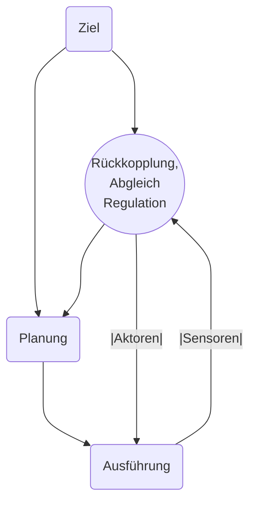

# Motorik 1

## [[Handlungsregulation]]

Siehe hier ein Ablaufschemata, wie eine Handlung bestimmt wird. Zielsetzung, Planung und Ausführung wird ständig durch eine Rückkopplung / einen Abgleich  reguliert.
Es gibt nun verschiedene Ebenen auf denen dieser *Abgleich* geschehen kann. Hacker (1996) unterscheidet hier zwischen drei Ebenen.

1. Bewusste Handlungen: Intellektuelle Regulationsebene; Auf dieser Ebene ist nur eine bewusste, intelletuelle Handlung gleichzeitig möglich
2. Routinehandlungen: flexible Handlungsmuster; Auf dieser Ebene sind nur wenige parallele Routinehandlungen möglich
3. Vollständig automatisierte Handlungen auf einer sensomotorischen Ebene; Bewusst wird nicht mehr eingegriffen

## [[Steuerung]]

![[Screenshot 2024-03-13 at 2.03.53 PM.png]]

## [[Regelung]]

![[Pasted image 20240313140417.png]]

## [[Fitts's Law]]

Fitt's Law ist eine Beschreibung dafür, wie schnell wir eine Eingabe mit einem Gerät tätigen können.

The reason why pie menus are good has to do with [[Fitts's Law]], one of the most reliable theories in all of [[Kommunikation|Mensch zu Computer Kommunikation]], which has been empirically verified time and time again. Sadly, a lot of people who do UI design, even professionals, don't know about this simple and useful formula.
$$
T = a + b \cdot \log_2 \left( \frac{D}{W} + 1 \right)
$$
where $T$ is the time taken to move a pointing device to a target. $a$ and $b$ are constants, which depend on the hardware and the individual person using it. So they're generally outside the control if UI designers. $D$ is the distance from the starting point to the center of the target. $W$ is the width of the target, in the direction of motion.

![[Pasted image 20240313141547.png]]

[Fittss Law Software](http://www.yorku.ca/mack/FittsLawSoftware/)

[Visualizing Fitss Law](http://www.particletree.com/features/visualizing-fittss-law/)

Die Seiten und Ecken eines Bildschirmes bei der Maussteuerung sind vorteilhafte Orte, da diese einfacher zu treffen sind. 

![[Pasted image 20240313141902.png]]

Die Eigenschaften von [[Fitts's Law]] werden unter anderem in Pie Menüs ausgenutzt. Zusätzlich gibts es auch andere Ideen. 

[Interaction Museum | OctoPocus](https://hci-museum.lisn.upsaclay.fr/octopocus)