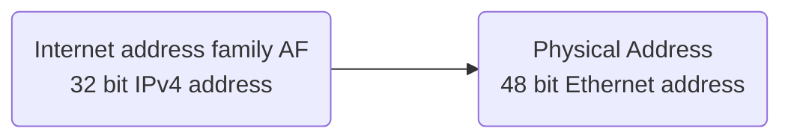
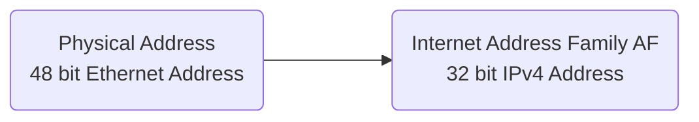

# Sockets, Windows Networking

Let's recall: The [[Data Link Layer]] in the [[OSI reference model]] is associated with a [[Local Area Network|LAN]]. [[Physical Layer|L1]] is the [[OSI reference model]] layer associated with a [[Local Area Network|LAN]] as well.

![[Pasted image 20231128081838.png]]

[[Media Access Control|MAC]] synchronises access from different hardware sources to the same physical [[Networking|Network]] interface. It ensures error-free delivery to both [[Physical Layer|L1]] [[Protocol|Protocols]] and [[Logical Link Control|LLC]]. [[Media Access Control|MAC]] is indeed the addressing scheme used by [[Physical Layer|L1]]'s Ethernet as well.

## [[Address Resolution Protocol]] ([[Address Resolution Protocol|ARP]])

We use [[Address Resolution Protocol|ARP]] to map a 32 bit [[IP Address]] to a 48 bit unique *Ethernet* address which itself consists of a *Organisationally Unique Identifier* and a [[Media Access Control|MAC]] which is vendor assigned. The [[Address Resolution Protocol|ARP]] is the [[Networking|Network]] [[Protocol]] for resolving [[OSI reference model|OSI]] [[Network Layer|L3]] Addresses (such as [[IPv4]] addresses) to [[OSI reference model|OSI]] [[Data Link Layer|L2]] Addresses. 

We transform a *[[Internet Address family]]* (AF) sort of dynamic mapping to a physical address which is transparent to application and user. This mapping is of no concern for system administrators. 

### [[Address Resolution Protocol|ARP]] Role

For Communication between hosts inside a [[Local Area Network|LAN]], their physical addresses ([[Media Access Control|MAC]]) are used. 

- When one host wants to send data to another host
- It looks for the [[Media Access Control|MAC]] Address of the destination host in its [[Address Resolution Protocol|ARP]] cache.

If the address is not there, it send a*broadcast* to retrieve it. Whenever [[Address Resolution Protocol|ARP]] requests are broadcasted, that message is to be read by every machine.

### [[Address Resolution Protocol|ARP]] Pervalance

The combination is [[IPv4]] and Ethernet represents the overwhelming majority of [[Local Area Network|LANs]]. For [[IPv6]] [[Address Resolution Protocol|ARP]] is replaced by the *Neighbour Discovery Protocol* (NDP). Inside a [[Local Area Network|LAN]], the [[Media Access Control|MAC]] address in the Ethernet [[Frames|Frame]] is used to [[Routing|Route]] [[Frames]] from one machine to another.

### [[Address Resolution Protocol|ARP]] Cache

> [!Definiton]  
> The [[Address Resolution Protocol|ARP]] *cache* is a table containing [[IP protocol|IP]] to [[Media Access Control|MAC]] address mappings.

![[Pasted image 20231127080311.png]]

The [[Address Resolution Protocol|ARP]] cache is stored on each system communicating on the [[Local Area Network|LAN]].

## [[Reverse Address Resolution Protocol]] ([[Reverse Address Resolution Protocol|RARP]])

There also exists a reverse [[Protocol]] for [[Address Resolution Protocol|ARP]]. A physical machine in a [[Local Area Network|LAN]] can use [[Reverse Address Resolution Protocol|RARP]] to learn its [[IP Address]] from a gateway servers [[Address Resolution Protocol|ARP]] table in cache. When a new machine is set up, it can request the [[Reverse Address Resolution Protocol|RARP]] server on the [[Router]] to send its [[IP Address]]. If it exists, the [[Reverse Address Resolution Protocol|RARP]] server will return the [[IP Address]] to that machine which can store it for future use. 

## [[Socket|Sockets]] And Their Purpose

![[Pasted image 20231128082054.png]]

In the beginning the [[Image Loader]] creates some [[Process|Processes]]. One of these [[Process|Processes]] are sometimes needed to use some services from a remote [[Process]]. To do this,

1. It first needs to locate the other [[Process]]
2. Then it can send a message to ask for the desired service

Assuming that these [[Process|Processes]] want to communicate with each other. What would they need to do so? A [[DNS Infrastructure]].

### Implementing Network Communication

For the initiator, the first step is to locate the target host. While each host must give all others the chance to locate it by using a specific addressing scheme, in this case an [[Internet Address family|Address Family]]. We therefore can call [[IPv4]] Addresses also `AF_INET` addresses. The second step is to find the target. [[Process]] on a specific host.

![[Pasted image 20231128082509.png]]

How can we implement these two steps? An [[Operating System|OS]] implements this concept by using [[Socket|Sockets]]

> [!Definiton]  
> A [[Socket]] is a combination of [[IP Address]] and [[Port Numbers|Port]]. 

A [[Socket]] is a matter of definition. We just define it instead of actually implementing it. 

![[Pasted image 20231128082558.png]]

The same [[Socket]] can be used for sending and receiving messages. A [[Process]] might use more than one [[Port Numbers|Port]]. Each of its [[Port Numbers|Ports]] can be used in an individual [[Socket]]. However, a [[Process]] cannot share the same [[Port Numbers|Port]] with other [[Process|Processes]] on the same host. Thus, there exists no shared [[Socket|Sockets]]. For communication between two [[Socket|Sockets]], any [[Network Layer|L3]] [[Protocol]] can be used. Mostly [[TCP protocol|TCP]], sometime [[User Datagram Protocol|UDP]]. 

## Types of Sockets

There are *three* types of [[Socket|Sockets]] available:

1. [[Datagram Socket]]
2. [[Raw Sockets]]
3. [[Stream Socket]]

### Message Passing

There are *two* basic operations for message passing: 

- send
- receive

A queue is associated with each destination.

### Communication Types

We determine between two communication types

- *synchronous*: blocking basic operations
- *asynchronous*: a non-blocking send operation using an *input buffer* filling in the background. Non-Blocking is more or less theory and very hard to implement.

Transmission in parallel with other tasks in the sending process. 

## [[DNS Infrastructure]]

Every host is cyberspace is to be identified with a unique [[IP Address]]. It is almost impossible to remember the exact [[IP protocol|IP]] of a host. Thus, a host name is used instead. This name will be translated to an [[IP Address]] by using a [[DNS Infrastructure]]. 

> [!Definition]  
> The [[DNS Infrastructure]] encompasses various entities and is based on a collaboration among them
> - Computing and communication entities
> - Geographically distributed throughout the world

## [[Stream Socket]]

![[Pasted image 20231128082905.png]]

## [[Datagram Socket]]

A [[Datagram Socket]] is connectionless and based on [[User Datagram Protocol|UDP]]. Either party simply sends data units called [[Datagram]]s as needed and waits for the other to respond. Messages can be lost in transmission or received out of order. 

## [[Raw Sockets]]

[[Raw Sockets]] do not support transmission [[Protocol|Protocols]] like [[TCP protocol|TCP]] and [[User Datagram Protocol|UDP]]. They are used for custom, low-level [[Protocol]] development.

# [[Windows Networking]]

![[Pasted image 20231128083105.png]]

We distinguish between server and client side. See here a schematic view of connection oriented client-server-communications. 

![[Pasted image 20231127092153.png]]

After binding an address, a connectionless server is *not different* from a connection-oriented server. It can send and receive data over the socket simply by specifying the remote address with each operation.

[[Windows]] implements several [[Networking]] APIs ([[Windows Networking]]). Why implement so many of them? 

- to provide applications and efficient, portable and standardised functionality
- to provide support for legacy applications
- to gain compatibility with industry standards
- to offer [[Networking]] capabilities that are independent of particular [[Networking|Network]] implementations

Such as

- [[WinSock]]
- Winsock Kernel (WSK)
- Web access APIs
- and so on

## [[WinSock|WinSock]]

The original [[WinSock]] was Microsoft's implementation of [[BSD Sockets]], the standard by which UNIX systems have communicated over the Internet since the 1980s. BSD enables [[Process|Processes]] existing on the same machine to communicate with each other. They do not have to run under the same [[Operating System|OS]].  
[[WinSock]] offers most of the functionality of [[BSD Sockets]], but also includes Microsoft specific enhancements. [[WinSock]] enables reliable, conneciton-oriented communication. [[WinSock]] supports unreliable, connectionless communication as well. Since version 2.2, [[WinSock]] adds numerous features beyond the [[BSD Sockets]] specification.

### Server Operations

1. Initialise [[WinSock]]
2. Create a [[Socket]] via `create()`. A created [[Socket]] is still unconnected.
3. Via `listen()` we place the [[Socket]] in a listening state for an incoming client connection request
4. `bind()` *binds* it to a local address to enable clients connecting to the server. This varies on the [[Protocol]] selected.
5. Performs an `accept()` operation to allow a client to connect to the [[Socket]]. 
6. After a connection is made, the `accept()` function returns a new [[Socket]]. It represents the real end of the connection. The original [[Socket]] used for listening is not used for communication, but only for receiving connection requests.
7. Shutdown the connection if no more data will be sent.
8. Cleanup

### Client Operations

1. Initialise [[WinSock]]
2. Create a [[Socket]] for connecting to the server via `create()`
3. We use a [[Protocol]]-independent translation from an ANSI host name to an [[IP Address]] using `getaddinfo()`. This resolves the server address and [[Port Numbers|Port]] with DNS. [[WinSock]] is a [[Protocol]]-independent API. Therefore, an address can be specified for any [[Protocol]] installed on the system over which [[WinSock]] operates. 
4. Use the client [[Socket]] and *try* to connect to a server [[Socket]] via `connect()`. Attempt to connect to an address until one succeeds. 
5. Perform `receive()` and `send()` operations.
6. Connect to the server
7. Send data from an initial buffer, receive until the peer closes the connection and fill up the buffer and continue sending.
8. Shutdown the connection since no more data will be sent
9. Cleanup

### [[WinSock]] Extensions

Microsoft has added a handful of functions that are not part of the [[BSD Sockets]] Standard, e.g. to achieve better performance for Web servers on [[Windows]]. 

# Anki

#todo 