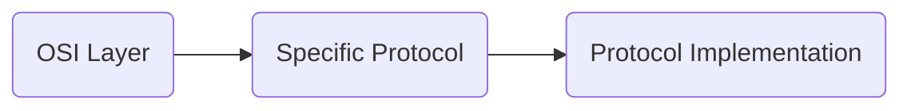
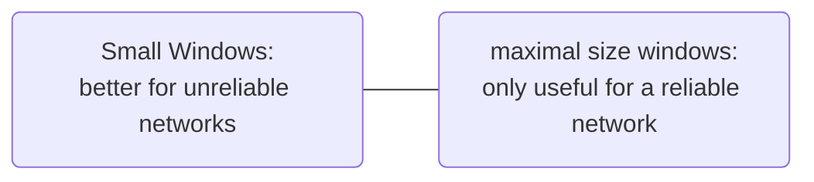

# TCP in Detail

![[Pasted-image-20231106075223.png]]

[[TCPIP protocol stack|TCPIP]] is synonymous with the [[Transport Layer]] and [[Network Layer]]. Each layer adds its own header (metadata). Usually added to the beginning, or also called *header*.

![[Pasted-image-20231106184817.png]]

## The Working Layer Model

![[Pasted-image-20231106185353.png]]

## [[Packets]]

Even though, the the *[[Packets]]* is used for all layers, we should use these specific terms:

| Nr | Layer | Specific Term |
| ---- | ---- | ---- |
| 1 | [[Application Layer]] | [[Packets\|packet]] |
| 2 | [[Transport Layer]] | [[Segment\|Segment]] |
| 3 | [[Network Layer]] | [[Datagram]] |
| 4 | [[Physical Layer]] | [[Frames\|Frame]] |

> [!Info]  
> A [[Packets|packet]] consists always of a *header* and a *dataunit*.

## [[Request for Comments]]

[[Protocol|Protocols]] such as [[TCP protocol|TCP]], [[IPv4 protocol|IP]], [[Internet Control Message Protocol|ICMP]] and [[User Datagram Protocol|UDP]] are defined in the [[Request for Comments]] ([[Request for Comments|RFC]]) document series. They contain technical and organisational notes about the internet. They cover many aspects of computer [[Networking]], such as

- [[Protocol]] specification
- deployment procedures
- concepts and
- meeting notes and opinions

[IETF | Internet standards](https://www.ietf.org/standards/)

## [[Port Numbers]]

Server [[Process|Processes]] *listen* on a [[Port Numbers|Port]]. [[Port Numbers]] uniquely identify a [[Process]] on a computer.

Since [[Port Numbers|Port]] identifiers are selected independently by each [[TCP protocol|TCP]] they might not be unique, but both the server and client must know this. Listening [[Port Numbers|Ports]] are *open*. Non-Listening [[Port Numbers|Ports]] are *closed*. See here some examples of well-known [[Port Numbers]]:

| Tcp Port | Layer | Name | Detail |
| ---- | ---- | ---- | ---- |
| 22 | [[Application Layer\|L7]] | SSH | [[Secure Shell]] |
| 23 | [[Application Layer\|L7]] | Tor | Onion Anonymity Network |
| 53 | [[Application Layer\|L7]] | DNS | Domain Name Server (only for the operation zone transfer) |
| 80 | [[Application Layer\|L7]] | HTTP | [[Hyper Text Transfer Protocol]] |

The basic transfer element of a [[Protocol]] is called a *message*.

![[Pasted-image-20231106185708.png]]

Or here, [[TCP protocol|TCP]] [[Port Numbers|Ports]] for [[File Transfer Protocol|FTP]]. Control Connection means information, such as [[Port Numbers|Port]] commands to tell the server what [[Port Numbers|Port]] the client will be listening on for the data channel connection.

![[Pasted-image-20231106185921.png]]

| [[TCP protocol\|TCP]] [[Port Numbers\|Port]] | Layer | Name | Detail |  |  
| ---- | ---- | ---- | ---- | ---- |  
| 20 | [[Application Layer\|L7]] | [[File Transfer Protocol\|FTP]] | [[File Transfer Protocol]]: data channel |  |  
| 21 | [[Application Layer\|L7]] | [[File Transfer Protocol\|FTP]] | [[File Transfer Protocol]]: command channel |  |

Meaning, a Connection can use mire than just one [[Port Numbers|Port]].

## Communication between [[Process|Processes]]

![[Pasted-image-20231106190039.png]]

[Service Name and Transport Protocol Port Number Registry](https://www.iana.org/assignments/service-names-port-numbers/service-names-port-numbers.xhtml)

## [[TCP protocol|TCP]] Essentials

[[TCP protocol|TCP]] is the most widely used transport [[Protocol]]. [[Process|Processes]] deliver data to [[TCP protocol|TCP]] and a *stream* of [[Packets]] [[Stream Interface]], which can be arbitrarily large. A [[TCP protocol|TCP]] connection has *two* endpoints, meaning its [[Port Numbers|Port]] to [[Port Numbers|Port]].

[[TCP protocol|TCP]] break streams into [[Segment|Segments]]:

1. The original stream is numbered by bytes
2. [[Segment|Segments]] contain *Sequence numbers* of data bytes
3. A payload for the [[IPv4 protocol|IP Protocol]]

*Full duplex* exchanges data in both directions simultaneously.

### [[Stream Interface]]

> [!Definition]  
> A [[Stream Interface]] is a continuous byte stream delivered by applications. 

## [[TCP protocol|TCP]] Background

![[Pasted image 20231106190426.png]]

A [[TCP protocol|TCP]] connection has two endpoints. [[TCP protocol|TCP]] has different views to each adjacent layers.

- [[TCP protocol|TCP]] in from [[Application Layer|L7]]: [[TCP protocol|TCP]] gets its payload as a chunk of bytes from [[Application Layer|L7]].
- [[TCP protocol|TCP]] out to [[Network Layer|L3]]: A [[Stream Interface|Byte Stream]] consists of [[Segment|Segments]] as payload to [[Network Layer|L3]]. The [[Network Layer|L3]] [[Protocol]], e.g. [[IPv4 protocol|IP]] treats [[TCP protocol|TCP]] like data and does not interpret any contents of the [[TCP protocol|TCP]] message.
- [[TCP protocol|TCP]] to [[TCP protocol|TCP]]: a [[TCP protocol|TCP]] receiver sends acknowledgements (ACKs) for [[Segment|Segments]] received correctly from the sender. A [[TCP protocol|TCP]] sender expects AKCs afterwards.

In most cases, we use an additional [[Protocol]] between [[TCP protocol|TCP]] and [[Application Layer|L7]] ([[Presentation Layer|L6]]), also called the [[Transport Layer Security]] ([[Transport Layer Security|TLS]]) which provides encrypted [[Application Layer|L7]] data. [[Transport Layer Security|TLS]] has its own records with its own headers.

[[TCP protocol|TCP]] provides reliable delivery and ensures the *integrity* of data being transferred. It provides sequencing of bytes transferred in [[Packets]] (also called [[Segment|Segments]]) and provides retransmission, if necessary. Must familiar [[Application Layer|L7]] [[Protocol|Protocols]] use [[TCP protocol|TCP]], such as

- Web browsing ([[Hyper Text Transfer Protocol|HTTP]])
- Secure Shell ([[Secure Shell|SSH]])
- File Transfer ([[File Transfer Protocol|FTP]])
- Email (SMTP, POP, IMAP)
- Network Management ([[Simple Network Management Protocol|SNMP]])

## Header

The [[TCP protocol|TCP]] header format is documented in [RFC 793](https://www.rfc-editor.org/rfc/rfc793). The same header format is used in both directions. A [[Segment]] carries a header along with data.

![[Pasted image 20231106090520.png]]

*Sequence number* (SYN) is used to keep data in proper order. *Acknowledgement number* (ACK) if the ACK Flag is set, the sender expects the set Acknowledgement Number.

## Establishing a Connection

[[TCP protocol|TCP]] is *connection-oriented*. Therefore, [[TCP protocol|TCP]] uses a *[[Three-Way-Handshake]]* to establish such a connection. For a reliable connection establishment and termination. [[TCP protocol|TCP]] utilizes a *reliable connection setup*. The *Thee-Way-Handshake* guarantees a reliable startup. 

*Graceful connection Shutdown*: [[TCP protocol|TCP]] guarantees delivery of all data until endpoint shutdown. [[TCP protocol|TCP]] verifies the correct delivery of data from client to receiver. [[TCP protocol|TCP]] will retransmit lost [[Segment|Segments]].

![[Pasted image 20231106190914.png]]

## [[Three-Way-Handshake]]

![[Pasted image 20231106191215.png]]

Because here steps 2 and 3 can be combined in a single message, this is called the [[Three-Way-Handshake]]. Sequence Numbers are used to *synchronize* a communication between $A$ and $B$. Sequence numbers are not tied to a global clock in the network. 

### [[TCP protocol|TCP]] [[Three-Way-Handshake]]

The initial sequence number (ISN). Handshaking is an ISN exchange, indeed. After handshaking, a connection is established.

![[Pasted image 20231106094643.png]]

Here [[TCP protocol|TCP]] handshake establishes a connection. It is initiated by one [[TCP protocol|TCP]] SYN and responded to by a SYN, ACK.

## Data Communication

![[Pasted image 20231106190426.png]]

The Sequence Number is used to determine the position of the first byte in my [[Segment|Segments]] data. The Acknowledgement number determines the position of the next byte I expect from you. Therefore, we can identify the position of each byte in the sequence.

How does one number bytes within a [[Segment]]:

- The first byte immediately following the header is the lowest numbered
- The following bytes are numbered consecutively.

A fundamental notion in this design is the *every byte of data* sent over a [[TCP protocol|TCP]] connection has a Sequence Number. Since every byte is sequenced, each of them could be acknowledged. However, the acknowledgement mechanism employed is cumulative. So that an ACK of sequence number $X$ confirms all bytes up to but not including $X$ have been received.  
The Acknowledgement Number contains the next Sequence Number that a receiving host is expecting to receive from the sender. The first [[Packets|packet]] in the [[Stream Interface|Stream]] carries the actual payload (here, the clients [[Hyper Text Transfer Protocol|HTTP]] request).

### Parallel [[TCP protocol|TCP]] [[Three-Way-Handshake|Handshake]] in a Single [[Session]]

Such as a parallel [[Hyper Text Transfer Protocol|HTTP]] connection

![[Pasted image 20231106191456.png]]

![[Pasted image 20231106100449.png]]
## [[Round Trip Time]] And [[Latency]]

> [!Definiton]  
> The sum of the path [[Latency|Latencies]] for a specific [[TCP protocol|TCP]] [[Segment]] to be acknowledged is called the network [[Round Trip Time]] ([[Round Trip Time|RTT]]).

![[Pasted image 20231106191826.png]]

> [!Defintion]  
> [[Bandwidth]] is the possible transmitted data in a given time.

> [!Defintion]  
> [[Jitter]] is the variation in time taken to deliver a series of messages

> [!Definiton]  
> [[Latency]] is the delay of network access.

![[Pasted image 20231106192015.png]]

## Retransmission Layer

When [[TCP protocol|TCP]] transmits a [[Segment]] containing data, it puts a copy in a *retransmission queue* and starts a *retransmission timer*. When the acknowledgement for that data is received, the [[Segment]] is deleted from the queue.

![[Pasted image 20231106192516.png]]

## Keep Alive Timer

Proposed in [[Request for Comments|RFC]] 1122. The Keep Alive Timer allows [[TCP protocol|TCP]] to periodically check whether the other end of the connection is still alive. The default value of this timer is *2 hours*. After the expiration of the timer, probes are sent to the remote end (a keep alive [[Segment]]). The connection is then dropped if the remote does not respond to the probes. The real value depends on the specific implementation.

## Other [[TCP protocol|TCP]] Control Bits (flags)

These flags are used together with the new `ECT` and `CE` flags in the [[IPv4 protocol|IP]] header for *[[Explicit Congestion Notification]]* ([[Explicit Congestion Notification|ECN]]), a method for an intermediate [[Router]] to notify the end hosts of impending [[Networking|Network]] congestion.

| Flag | Detail |  |
| ---- | ---- | ---- |
| NS | [[Explicit Congestion Notification\|ECN]] notice |  |
| CWR | Congestion Window Reduced due to [[Networking\|Network]] congestion, reduced window size |  |
| ECE | [[Explicit Congestion Notification\|ECN]] echo: explicit congestion notification echo, connection is experiencing congestion |  |

### URG

Notifies the receiver to process the urgent [[Segment]] before processing all other [[Packets]]. Part of the data within a [[Segment]] are urgent and should be handled with priority. The urgent Pointer in the Header points to the sequence number if the **last** byte + 1 in a sequence of urgent data, counting from the first byte of the [[Segment]] data.

### PSH

Tells the receiver to process these [[Packets]] as they are received, instead of buffering them.

### RST

`RST` Forcefully terminated the connection. Unexpected [[Segment|Segments]] must be sent whenever a [[Segment]] arrives which apparently is not intended for the current connection.

### FIN

`FIN` Means no more data from sender; Request a *graceful* termination of connection.

### Checksum

It is used for error detection. To check if the [[TCP protocol|TCP]] header is ok (or manipulated? Corrupted? …)

### Urgent Pointer

It is used in combination with the `URG` flag. Indicated where the urgent data ends.

### Options

Can be anywhere between $0$ and $32$ bits.

- optional
- predefined
- options for other field or
- related to other [[Protocol|Protocols]]

> [!Example]  
> The Window Field [[Process]] to [[Process]] communication. It is related to the fact that [[TCP protocol|TCP]] [[Segment|Segments]] are payload for [[IPv4 protocol|IP]] [[Packets]].
> 
> ![[Pasted image 20231106104528.png]]

### Data Offset

Determines where the payload ([[Packets|packet]] content) begins, or also header length. The number of 32 bit words up tot the payload. The maximum size for the Header length fields, when all possible options are selected, is $60$ bytes.  
Only a one digit hex value is set aside for indicating the [[TCP protocol|TCP]] header length

$$
\mbox{max possible value} = \mbox{hex F (0xF} = \mbox{decimal }15\mbox{)} = 15 \times4\mbox{-byte chunks} = 60 \mbox{ bytes}
$$

Otherwise, it would be a $20$ bytes header. Therefore, the [[TCP protocol|TCP]] header's length must be a multiple of 4 bytes.

## [[Window Field]] And [[Window Field|Window Field Scaling]]

Maximum Window size is $2^{16} -1 = 65535$, meaning the size of bytes of buffer space (in bytes) a host (sender or receiver) has available for data it can deal with.  
The receiver governs the amount of data sent by the receiver. The receiving [[TCP protocol|TCP]] reports a *window* to the sending [[TCP protocol|TCP]]. What does the value in the [[Window Field]] tell the other side? It tells it how many bytes it is allowed to send before stop and wait for an acknowledgement. Default Window size is $4128$

Zero means "send no data". No [[Segment|Segments]] should be acceptable except ACK [[Segment|Segments]].

# Anki

#todo
