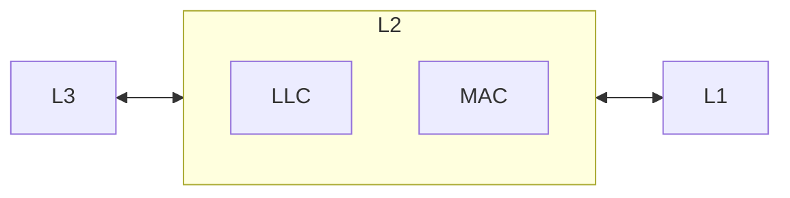

# TCP, UDP, IP

## Sliding Window

*Sliding Window* means that each communication partner might change the window size dynamically by, for example, reducing the size if a congestion is anticipated.  
Modern, fast networks can handle windows much larger than 65k ([[Request for Comments|RFC]] 1323).

> [!Definition]  
> The [[Window Field]] option multiplies the window's size value found in a [[TCP protocol|TCP]] header. The *scale factor* is carried in a new [[TCP protocol|TCP]] option, being sent only in a SYN [[Segment]]. A [[Window Field|Window Field Scaling]] option is a [[Segment]] without a SYN should be ignored.

With [[Window Field|Scaling]], the maximum window size increases to $2^{30} - 1 = 1073741823$ bytes or roughly $1$ GB.

> "If a [[TCP protocol|TCP]] receives a SYN [[Segment]] containing a [[Window Field|Window Scaling]] option, it sends its own [[Window Field|Window Scaling]] option in the SYN, ACK [[Segment]]."

\- [[Request for Comments|RFC]] 2323

![[Pasted image 20231113080411.png]]  
![[Pasted image 20231113080459.png]]

$3$ Bytes are used to indicate that the [[TCP protocol|TCP]] is prepared to do both send and receive [[Window Field|Window Scaling]]. It sends a *scale factor* to be applied to its receive window".

> [!Quote]  
> "Option is an offer, but not a promise."  
> "Both sides must send [[Window Field|Window Scaling]] options in their SYN [[Segment|Segments]] to enable [[Window Field|Window Scaling]] in either direction."

## Unknown Scaling Factor

In this stage, Wireshark does not see the [[Three-Way-Handshake]]. Therefore, this value may or may not be the true [[Window Field|Window Scaling]].

![[Pasted image 20231113080910.png]]

## [[User Datagram Protocol]] ([[User Datagram Protocol|UDP]])

> [!Definition]  
> [[User Datagram Protocol]] ([[User Datagram Protocol|UDP]]) is a [[Transport Layer]] [[Protocol]] to send messages from one [[Port Numbers|Port]] to another with a minimum of overhead.
> 
> - [[User Datagram Protocol|UDP]] is only transaction oriented (in contrast to [[TCP protocol|TCP]])
> - no connection means no [[Three-Way-Handshake]]
> - no reliable delivery
> - no data integrity
> - no ordered delivery


All of this makes [[User Datagram Protocol|UDP]] more appropriate for small amounts of transactional data as well as for time-sensitive processes.

- Retransmission means bigger [[Latency]]
- Handshaking for a connection means overhead

## Background

![[Pasted image 20231114081935.png]]

The [[User Datagram Protocol|UDP]] Header is way smaller than the [[TCP protocol|TCP]] header ($8$ vs. $20$ Bytes).

1. *Source [[Port Numbers|Port]]* is an optional [[Port Numbers|Port]] and might be used for a reply. If the source [[Port Numbers|Port]] is zero, it should not be used.
2. *Checksum* is also not mandatory. An all zero transmitted checksum value means that the transmitter generated no checksum. If the computed checksum is zero, it is transmitted as all ones.

![[Pasted image 20231113083338.png]]

## Where is [[User Datagram Protocol|UDP]] Used?

Live Streaming of audio or video: [[Packets]] loss is here to some extent OK (due to limitation of human sensory organs). Rather low [[Latency]] is essential. [[TCP protocol|TCP]] is better for Video on demand.

[[Application Layer|L7]] protocols or other tasks with low overhead requirements:

| Name | Detail |
| ---- | ---- |
| [[Simple Network Management Protocol]] ([[Simple Network Management Protocol\|SNMP]]) | [[User Datagram Protocol\|UDP]] [[Port Numbers\|Port]] 161 |
| DNS | [[User Datagram Protocol\|UDP]] [[Port Numbers\|Port]] 53 |

## [[IP protocol|Internet Protocol]] ([[IP protocol|IP]])

There are two versions of the [[IP protocol|Internet Protocol]] ([[IPv4]] and [[IPv6]]). The [[IP protocol|IP]] has its own [[Packets|Protocol Data Unit]], also called a [[Datagram]]. Like any other [[Protocol]], such as [[TCP protocol|TCP]], [[IP protocol|IP]] has its own header. It carries other [[IP protocol|Internet Protocol]]s from [[Transport Layer|L4]] and even [[Network Layer|L3]] in the [[OSI reference model]], such as

- [[TCP protocol|TCP]]
- [[User Datagram Protocol|UDP]]
- [[Internet Control Message Protocol|ICMP]]

[[IP protocol|IP]] is responsible for *moving [[Packets]]* of data from host to host. [[IP protocol|IP]] provides *unreliable [[Datagram]] [[Routing]]* over a path between hosts.

## [[IPv4]] Header

Firstly developed in the 1970s. Its [[Request for Comments|RFC]] 791 was published in 1981:

![[Pasted image 20231113090518.png]]

The [[IP Address]] (source and destination) is 32-Bit and is intended to

- identify an individual host on a [[Networking|Network]]
- refer to a specific machine in cyberspace
 
![[Pasted image 20231114082744.png]]

An [[IPv4|IPv4]] address uses a readable *dotted decimal* notation. Every [[IPv4]] address has two parts: A *Network Address component* and a *Host Address component*. One part identifies the [[Networking|Network]] (or a specific [[Local Area Network|LAN]]). The other part identifies the specific *host*. The *embedded structure* helps to create smaller [[Networking|Networks]] (domains). It helps to better utilise the bits in the host address part. An [[IP protocol|IP]] network can be subdivided into smaller [[Networking|Networks]], also called *[[Subnet|Subnets]]*.

![[Pasted image 20231114083720.png]]

### [[IP Header Length (IPv4)]]

IP header length means the total header length in 32 bit word (usually 5), which points to the beginning of data. 

### [[Total Length (IPv4)]]

Total Length is the length of data and header in bytes. It allows to length of a [[Datagram]] to be up to 65kb of data.

### [[Protocol (IPv4)]]

[[Protocol (IPv4)|Protocol]] describes the next level [[Protocol]]. It indicates the next level [[Protocol]] used in the payload (data portion) of the [[Datagram]]. It can also be another [[Network Layer|L3]] [[Protocol]]. Values are defined in [RFC 790: Assigned numbers](https://www.rfc-editor.org/rfc/rfc790).

### [[Type of Service (IPv4)]]

[[Type of Service (IPv4)|Type of Service]] determines how the [[Packets|packet]] should be handled in transit: Speed vs Reliability vs Throughput vs Precedence of a [[Datagram]]. In many [[Networking|Networks]], better performance for one of these parameters is coupled with worse performance of another one.  
When transmitting a [[Datagram]] through a particular [[Networking|Network]], these parameters are to be used to guide the selection of the actual service parameters.

![[Pasted image 20231113104901.png]]

### [[Fragmentation Fields (IPv4)]]

Header Checksum is a checksum on the header only. Since some header fields change (e.g. [[Fragmentation Fields (IPv4)|Time To Live]]). This is recomputed and verified at each point that the [[IP protocol|IP]] header is processed. Identification, Flags and Fragment Offset are normally not used due to security concerns.

### [[IP Address]]

> [!Definiton]  
> A [[IP Address]] identifies a specific host on a network.

## [[IPv6]] Header

Its [[Request for Comments|RFC]] 2460 was published in December of 1998. See here a basic [[IPv6]] header without extensions.

![[Pasted image 20231113090841.png]]

[IPv6 – Google](https://www.google.com/intl/en/ipv6/statistics.html)

## [[Local Area Network]] ([[Local Area Network|LAN]])

> [!Definition]  
> A [[Local Area Network|LAN]] is a bunch of hosts connected and administered together, connected by known [[Networking]] components, such as cables, access points, hubs and switches.

The first [[Local Area Network|LANs]] were developed in the 1960s. They all belong the **one physical location** (home, building, office, school). A host might be a desktop machine, a server or a mobile device. Each host is identified by its own [[IP Address]]. There are two different deployment architectures for a [[Local Area Network|LAN]]:

1. Client / Server
2. Peer-To-Peer

## [[Data Link Layer|L2]] And [[Local Area Network|LAN]]

[[Data Link Layer|L2]] is the [[OSI reference model]] layer associated with a [[Local Area Network|LAN]] which is implemented via *[[Logical Link Control]]* or [[Media Access Control]].



## [[Local Area Network|LAN]], [[Networking|Networks]] And [[Router]]

![[Pasted image 20231113093419.png]]

Here, we see multiple [[Local Area Network|LANs]] connected via [[Router|Routers]], [[Hub|Hubs]] and [[Switch|Switches]]

## [[Logical Link Control]]

[[Logical Link Control]] makes sure that [[Network Layer|L3]] [[Protocol|Protocols]] remain independent of the technology used for the [[Physical Layer|L1]], i.e. media independent. Its [[Packets|PDU]] holds a 8-bit-source and a 8-bit-destination address.

## [[Media Access Control]]

[[Media Access Control]] synchronises access (from different hardware sources) to the same physical network interface. It ensures an error-free delivery to both [[Physical Layer|L1]] [[Protocol|Protocols]] and [[Logical Link Control|LLC]].

## [[Router]]

> [!Definition]  
> [[Router|Routers]] move [[Packets]] of data between [[Networking|Networks]].

## [[Hub]]

> [!Definiton]  
> [[Hub|Hubs]] are [[Physical Layer|L1]] devices which receive and pass electrical signals (bits). They are passive devices. 

## [[Switch]]

> [!Definiton]  
> [[Switch|Switches]] are [[Data Link Layer|L2]] devices which receive and pass [[Packets]] (also called [[Frames]]). They are *active* devices (they use software and firmware).

## [[Subnet]]

Each [[Subnet]] is bounded by an [[IP protocol|IP]] [[Router]] and assigned a new [[Networking|Network]] ID, which is a [[Subnet]] of the original network address.

### Why Use [[Subnet|Subnets]]?

There are four reasons for using [[Subnet|Subnets]]:

1. [[Subnet|Subnetting]] is a mean to enable *easier management* of networks.
2. It enhances *security through segmentation*. When a [[Networking|Network]] is divided using [[Subnet|Subnets]], it is *not* possible for the systems on one [[Subnet]] to access systems on another. This gives some level of security and isolation for the systems within a [[Subnet]].
3. [[Subnet|Subnets]] help to *preserve [[IP protocol|IP]] Address space*.
4. [[Subnet|Subnetting]] improves *performance of [[Router|Routers]]*. In a large [[Networking|Network]] (without [[Subnet|Subnets]]) with multiple branches, it is a laborious procedure for the [[Router|Routers]] to store all the [[IP Address|IP Addresses]] used by individual systems in all branches. A [[Router]] that keeps all [[IP Address|IP Addresses]] of a large [[Networking|Network]], requires larger [[physical memory]] to uphold performance and needs more processing capacity to sustain its speed.

> [!Info]  
> [[Subnet|Subnetting]] makes only sense on larger [[Networking|Networks]] (with 255+ hosts).

### [[Subnet]] Masks

Lets assume we use the following [[IP Address]] for a certain system.

```txt
01101000 00010000 00101101 01100011 104.016.045.099
```

We must find a way to know which part is used as the network address. The remaining part is the host address. Thats why we define a 32-bit number, called a *[[Subnet]] mask*. All bits that belong to the network address are turned *on*, meaning they are set to $1$.

```txt
11111111 11111111 11110000 00000000 255.255.240.000
```

The rest goes to the *host address in the [[Subnet]]* and turned off (set to `0`). See here an example for a *[[Subnet]] mask*.

```txt
01101000 00010000 00101101 01100011 104.016.045.099
11111111 11111111 11110000 00000000 255.255.240.000
```

The interpretation of the [[IP Address]] by means of the *[[Subnet]] Mask* with 20 *mask bits* and 12 *subnet bits*.

```txt
01101000 00010000 00100000 000000000 104.016.032.000 network
```

In this [[Subnet]], $2^{12} -2$ hosts ($=4094$) with unique [[IP Address|IP Addresses]] are possible. One of them for example is `104.16.45.99`. Here possible addresses would be:

```txt
from 01101000 00010000 00100000 00000001 104.16.32.1
to   01101000 00010000 00101111 11111111 104.16.47.255
```

However, the last binary addresses with a host portion of all `1` cannot be used for a host address, since it is reserved for a special purpose: *broadcasting* [[Packets]] to every host on a [[Networking|Network]].  
Thus, the first and last address in any [[Subnet]] cannot be assigned to any individual host. Available addresses would be:

```txt
from 104.16.32.1
to   104.16.47.254
```

## [[Networking|Network]] To [[Networking|Network]] Communication

The differentiation between [[Networking|Networks]] makes [[Routing]] more efficient.

![[Pasted image 20231114082928.png]]

## [[Wide Area Networks]]

![[Pasted image 20231114082928.png]]

[[Wide Area Networks|WAN]] stands here for [[Wide Area Networks|Wide Area Network]].

## Routing

> [!Definiton]  
> [[Routing]] is the process of forwarding [[Packets]] from a source to a destination.

Specialised hardware devices used for [[Routing]] are called [[Router|Routers]].

# Anki

When should the *scale factor* of a [[TCP protocol|TCP]] message be ignored? #flashcard
When the SYN-flags has not been set.
<!--ID: 1707054910190-->

What does the term *sliding Window* mean for the communication over [[TCP protocol|TCP]] mean? #flashcard
Each communication partner might change the window size dynamically.
<!--ID: 1707054910192-->

When might a *Window Scaling Change* during a [[TCP protocol|TCP]] communication take place? #flashcard
For example, reducing the Window size if a congestion is anticipated.
<!--ID: 1707054910194-->

When might an *unknown Scaling Factor* occur (In for example Wireshark)? #flashcard
When Wireshark does not record the [[Three-Way-Handshake]], it cannot determine the Scaling Factor
<!--ID: 1707054910195-->

What is the *definition* of the [[User Datagram Protocol]]? #flashcard
[[User Datagram Protocol]] ([[User Datagram Protocol|UDP]]) is a [[Transport Layer]] [[Protocol]] to send messages from one [[Port Numbers|Port]] to another with a minimum of overhead.
<!--ID: 1707054910196-->

What does the *abbreviation* [[User Datagram Protocol|UDP]] mean? #flashcard
[[User Datagram Protocol]]
<!--ID: 1707054910197-->

[[User Datagram Protocol|UDP]] is *connection oriented*. (True or False) #flashcard
False. [[User Datagram Protocol|UDP]] is *transaction* oriented.
<!--ID: 1707054910198-->

What is a Use-Case for using [[User Datagram Protocol|UDP]] as a preferred [[Transport Layer]] [[Protocol]]? #flashcard
[[User Datagram Protocol|UDP]] is more appropriate for small amounts of transactional data as well as for time-sensitive processes.
<!--ID: 1707054910199-->

The [[User Datagram Protocol|UDP]] header is larger than the one of [[TCP protocol|TCP]]. (True or False) #flashcard
False. [[User Datagram Protocol|UDP]]'s header uses 8 Bytes vs. [[TCP protocol|TCP]]'s 20 bytes
<!--ID: 1707054910200-->

Which Header Fields of the [[User Datagram Protocol|UDP]] [[Protocol]] are optional? #flashcard 
- Checksum
- Source Port
<!--ID: 1707054910201-->

What is an example of an Application that might use [[User Datagram Protocol|UDP]] as [[Transport Layer]] [[Protocol]]? #flashcard
Live Streaming of Audio or Video.
<!--ID: 1707054910202-->

What is the specific term for [[IP protocol|IP]]'s [[Packets|PDU]]? #flashcard
[[Datagram]]
<!--ID: 1707054910203-->

What does the *abbreviation* [[Packets|PDU]] mean? #flashcard
[[Packets|Protocol Data Unit]]
<!--ID: 1707054910204-->

What does the *abbreviation* [[IP protocol|IP]] mean? #flashcard
[[IP protocol|Internet Protocol]]
<!--ID: 1707054910205-->

What are some [[Protocol|Protocols]] that might be transported by [[IP protocol|IP]]? #flashcard 
- [[TCP protocol|TCP]]
- [[User Datagram Protocol|UDP]]
- [[Internet Control Message Protocol|ICMP]]
<!--ID: 1707054910206-->

What is [[IP protocol|IP]]'s *responsibility*? #flashcard
[[IP protocol|IP]] is responsible for *moving* [[Packets]] of data from host to host.
<!--ID: 1707054910207-->

What are [[IPv4]]'s header fields and their sizes? #flashcard
| Field | Size |
| ---- | ---- |
| Version | 4 Bit |
| [[IP Header Length (IPv4)\|IP Header Length]] ([[IP Header Length (IPv4)\|IHL]]) | 4 Bit |
| [[Type of Service (IPv4)\|Type of Service]] | 8 Bit |
| [[Total Length (IPv4)\|Total Length]] | 16 Bit |
| Identification | 16 Bit |
| [[Fragmentation Fields (IPv4)\|Flags]] | 3 Bit |
| [[Fragmentation Fields (IPv4)\|Fragmentation Offset]] | 15 Bit |
| [[Fragmentation Fields (IPv4)\|Time To Live]] ([[Fragmentation Fields (IPv4)\|TTL]]) | 8 Bit |
| [[Protocol (IPv4)\|Protocol]] | 8 Bit |
| [[Fragmentation Fields (IPv4)\|Checksum]] | 16 Bit |
| Source Address | 32 Bit |
| Destination Address | 32 Bit |
| Options | 24 Bit |
| Padding | 8 Bit |
<!--ID: 1707054910208-->

What kind of *notation* is used for an [[IPv4]] address? #flashcard
A readable *dotted decimal* notation.
<!--ID: 1707054910209-->

What *two* parts are stored in a single [[IPv4]] Address? #flashcard 
- Network Address Component
- Host Address Component
<!--ID: 1707054910210-->

What is the specific *term* when one subdivides an [[IP protocol|IP]] [[Networking|Network]] into small er [[Networking|Networks]]? #flashcard
[[Subnet|Subnetting]]
<!--ID: 1707056605335-->

What is the *definition* of an [[IP Address]]? #flashcard
A [[IP Address]] identifies a specific host on a [[Networking|Network]].
<!--ID: 1707054910211-->

What Header Fields exist in a [[IPv6]] Header and how big are they? #flashcard
| Name | Size |
| ---- | ---- |
| Version | 4 Bit |
| Traffic Classe | 8 Bit |
| Flow Label | 20 Bit |
| Payload Length | 16 Bit |
| Next Header | 8 Bit |
| Hop Limit | 8 Bit |
| Source Address | 128 Bit |
| Destination Address | 128 Bit |
<!--ID: 1707054910212-->

What does the *abbreviation* [[Local Area Network|LAN]] mean? #flashcard
[[Local Area Network]]
<!--ID: 1707054910213-->

What is a [[Local Area Network]]? #flashcard
A [[Local Area Network|LAN]] is a bunch of hosts connected and administered together, connected by known [[Networking]] components, such as cables, access points, hubs and Switches.
<!--ID: 1707054910214-->

Hosts belonging to a single [[Local Area Network|LAN]] can spread all over the World. (True or False) #flashcard
False. They all belong to *one physical location*.
<!--ID: 1707054910215-->

What deployment architectures exist for a [[Local Area Network|LAN]]? #flashcard 
1. Client / Server
2. Peer-to-Peer
<!--ID: 1707054910216-->

Which [[Protocol|Protocols]] are associated with the [[Data Link Layer]]? #flashcard 
- [[Logical Link Control]] ([[Logical Link Control|LLC]])
- [[Media Access Control]] ([[Media Access Control|MAC]])
<!--ID: 1707056605340-->

What does the *abbreviation* [[Logical Link Control|LLC]] mean? #flashcard
[[Logical Link Control]]
<!--ID: 1707056605343-->

What does the *abbreviation* [[Media Access Control|MAC]] mean? #flashcard
[[Media Access Control]]
<!--ID: 1707056605346-->

How could a schematic view of a multiple [[Local Area Network|LANs]] being connected look like? #flashcard
![[Pasted image 20231113093419.png]]
<!--ID: 1707056605350-->

What is the task of the [[Logical Link Control]] [[Protocol]]? #flashcard
It makes sure that [[Network Layer|L3]] [[Protocol|Protocols]] remain independent of the technology used for [[Physical Layer|L1]].
<!--ID: 1707056605353-->

What is the [[Media Access Control]] [[Protocol]] doing? #flashcard
[[Media Access Control]] synchronises access to the same physical network interface.
<!--ID: 1707056605356-->

What is the *definition* of a [[Router]]? #flashcard
[[Router|Routers]] move [[Packets]] of data between [[Networking|Networks]].
<!--ID: 1707056605359-->

What is the *definition* of a [[Hub]]? #flashcard
[[Hub|Hubs]] are [[Physical Layer|L1]] devices which receive and pass electrical signals to all devices connected to it.
<!--ID: 1707056605363-->

What is the *definition* of a [[Switch]]? #flashcard
[[Switch|Switches]] are [[Data Link Layer|L2]] devices which receive and pass [[Packets]] (also called [[Frames|Frames]]). They are active devices.
<!--ID: 1707056605366-->

What are *four* reasons for [[Subnet|Subnetting]]? #flashcard 
1. *easier management* of [[Networking|Networks]]
2. *security through segmentation*
3. It helps to *preserve [[IP Address]] space*
4. Improves *performance of [[Router|Routers]]*
<!--ID: 1707056605369-->

What is the threshold for when [[Subnet|Subnetting]] makes sense? #flashcard
255+ hosts in a [[Networking|Network]]
<!--ID: 1707056605373-->

What does the *abbreviation* [[Wide Area Networks|WAN]] mean? #flashcard
[[Wide Area Networks|Wide Area Network]]
<!--ID: 1707056605376-->

What might be a schematic view of a [[Wide Area Networks|Wide Area Network]]? #flashcard
![[Pasted image 20231114082928.png]]
<!--ID: 1707056605379-->

What is the *definition* for [[Routing]]? #flashcard
[[Routing]] is the process of forwarding [[Packets]] from a source to a destination.
<!--ID: 1707056605382-->
