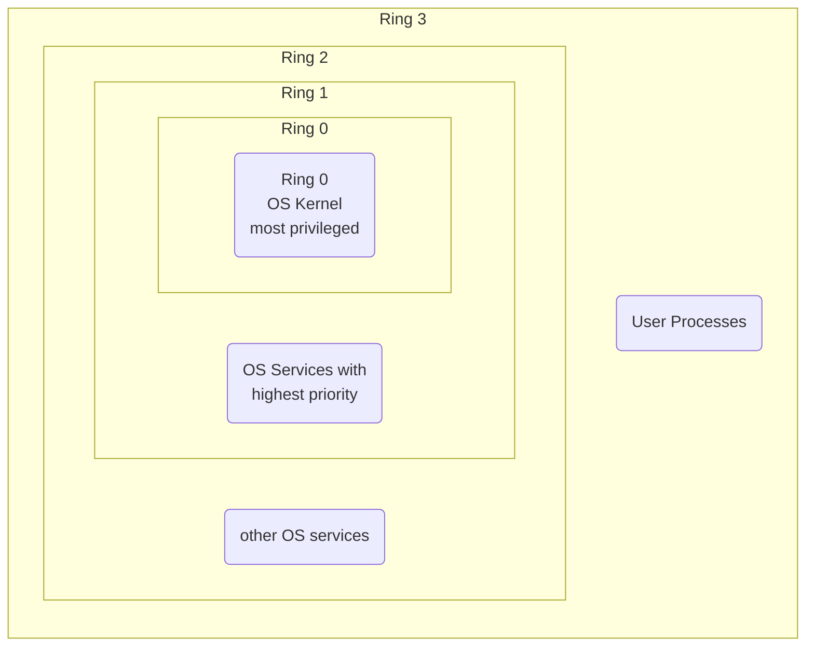

# Windows Memory Management 1

[[Memory Management]] is a component residing in the [[Windows executive|Executive Layer]]. 

## Physical Memory

![[Pasted image 20231022155830.png]]

See here [[physical memory]] with $2^4$ addressable bytes. The data-bus is used to transfer bytes from inside the [[physical memory]] to other parts of the PC. The address space that a 32-bit processor can address it its *address bus* is roughly $4$ Gigabytes ($2^{32}$ bytes). This address space is *flat*, meaning it is not differentiated.

## Segmentation of Memory

How does one separate the [[Kernel Address Space]] from the [[User Application Space]]? There are two levels to consider:

1. Code (e.g. instructions) whose code ([[User Application Space|UAS]] or [[Kernel Address Space|KAS]]) could execute certain machine instructions and whose code may access which parts of [[physical memory]] or other hardware access (IO).
2. Data (e.g. memory architecture) which data is dedicated solely to the [[Kernel]] or which data is accessible to [[User Application Space|UAS]].

A very simple method to *differentiate memory* is by using a few bits additionally to the address bits:

- for memory usage 
- for memory access by code 


## [[Segment]]

> [!Definition]  
> A [[Segment]] is a region inside [[physical memory]]. We can define "Segments" in order to separate Code and Data.
> 
> ```mermaid
> flowchart LR
> e1(Segment Address, \npoints to some start of a segment)
> e2{+}
> e3(offset)
> e4(Address, \npoints to a certain address \nin physical memory)
> 
> e1 --> e2
> e3 --> e2
> e2 --> e4
> ```

## [[Central Processing Unit]] ([[Central Processing Unit|CPU]])

Also called *[[Central Processing Unit|Von Neumann Architecture]]* for a multi-user, interactive and connected system.

![[Pasted image 20231022162408.png]]

## Ring Mechanism

The x86-architecture introduces so-called *privilege levels* to support memory protection.



The Ring Mechanism lets the [[Operating System|OS]] and [[Central Processing Unit|CPU]] collaborate to realize memory segmentation. At any given time, an x86 [[Central Processing Unit|CPU]] is running in a specific *privilege level*, which determines what code can and cannot do. Most modern x86 [[Kernel|Kernels]] use only two privilege level (0 and 3). The [[Central Processing Unit|CPU]] privilege level is just related to the [[physical memory]] and has nothing to do with [[Operating System|OS]] users, whether root, admin, guest or regular user.  
All [[Kernel]] code runs in ring 0, regardless of the user on whose behalf the code operates. All user code runs in ring 3, regardless of the [[Operating System|OS]] user on whose behalf the code operates.  
Due to restricted access to memory and IO ports, [[User Application Space|User mode]] can do almost nothing to the outside without calling on the [[Kernel]]. It can't open files or send network packets or print the screen or allocate memory. All the *data structures* that control these tasks cannot be touched directly by user code so actually a user [[Process]] is running inside a *sandbox*, run by the [[Operating System|OS]] [[Kernel]]. The [[Kernel]] *starts* and later *tears down* the individual sandbox for each user [[Process]]. 

> [!Info]  
> This is why [[Windows]] 95 and 98 crashed so much, because important data structures were left accessible to [[User Application Space|User mode]] for compatibility reasons.

## [[Virtual Memory address space|Virtual Memory]]

[[physical memory|Physical Memory]] is always very scarce. More [[Central Processing Unit|CPU]] power demands more [[physical memory]]. 


That's why we need to amplify [[physical memory]] in some way. One method of doing so is by using a so-called [[Virtual Memory address space]] that can be mapped to [[physical memory]].  

The Intel Architecture has three address spaces: 

- virtual
- linear
- physical

![[Pasted image 20231022170655.png]]

The [[Operating System|OS]] assigns each [[Process]] its own VM. The memory footprint for each [[Process]] looks like a single contiguous block of a large amount of memory. [[Virtual Memory address space|Virtual Memory]] of a [[Process]] can be non-contiguous. 

![[Pasted image 20231022225750.png]]

### How to Map [[Virtual Memory address space|Virtual Memory]] to [[physical memory|Physical Address Space]]

We use a [[Segment]] table to map virtual to linear addresses. In [[Linear Address Space]], we use corresponding block sizes to represent [[Segment|segments]]. Another, more detailed way to map [[Virtual Memory address space|Virtual Memory Address Space]] to [[physical memory|Physical Address Space]] when using multiple [[Process|Processes]] may be implemented via [[Frames]]. In addition, we need a mechanism to keep track of all free [[Frames]].

![[Pasted image 20231022182306.png]]

### [[Segment]]

> [!Definition]  
> [[Virtual Memory address space|Virtual Memory]] space is divided into blocks of variable length.  
> ![[Pasted image 20231022230301.png]]
> 
> ![[Pasted image 20231022230756.png]]
### [[Frames]]

> [!Definition]  
> A [[Frames|Frame]], or [[Frames|Page Frame]], is a fixed-size block in [[physical memory]], which size may be between $2^9 = 512$ bytes and $2^{13}=8192$ bytes. 
### [[Pages]]

> [!Definition]  
> A [[Pages|Page]] is a fixed-size block in [[Virtual Memory address space|Virtual Memory]], which is the same size as [[Frames]].

## Segmentation Model

When you want to access a byte in [[Linear Address Space]] you need a [[Segment]] selector and an offset as well as a so-called *base address*, which can be gathered using the *[[Global Descriptor Table]]* ([[Global Descriptor Table|GDT]]).

![[Pasted image 20231022172931.png]]

[[Segment]] descriptors provide the base address of [[Segment|segments]] as well as access rights, type and usage information. It gives the processor the *base address* of the [[Segment]] in [[Linear Address Space]].

## Paging Model

> [!Definition]  
> *Paging* is the process of transferring pages between [[physical memory]] and a secondary storage device.

A [[Pages|Page Table]] is needed to translate (map) virtual to physical addresses. Two parts are required to represent an address that can be used by the [[Central Processing Unit|CPU]]:

1. A [[Pages|Page]] number ($p$)
2. A [[Pages|Page]] offset ($d$)

used as an index into a [[Pages|Page Table]] which contains a *base address* of each [[Pages|Page]] in [[physical memory]] combined with the base address to define the [[physical memory|Physical Memory]] address to the memory unit. 

![[Pasted image 20231022231237.png]]

> [!Info]  
> Not all [[Pages]] in [[Virtual Memory address space|Virtual Memory Address Space]] are represented in [[Linear Address Space|Linear Address Space]]. Each [[Pages|Page]] of a [[Process]] in [[Virtual Memory address space|Virtual Memory]] might be in [[physical memory]] or it may be on the hard disk.
> ```mermaid
> flowchart TB
> id1(Required page is available in physical memory?)
> id1 -- No ---> id2(The OS need to go and get that Page)
> id1 -- Yes ---> id3(The OS simply uses that page\nof memory and grabs the data\nbeing requested)
> ```

## [[Page Directory]] And [[Page Directory|CR3]]

On non-extended x86 systems, each [[Process]] has a single [[Page Directory]]. We use an extended schema when determining our physical address in order to operate multiple [[Process|Processes]]. 

![[Pasted image 20231022183539.png]]

The [[Central Processing Unit|CPU]] obtains the location of the [[Page Directory]] from a privileged [[Central Processing Unit|CPU]]. As time proceeds, the [[Central Processing Unit|CPU]] must serve other [[Process|Processes]] alike. Thus, the [[Central Processing Unit|CPU]] selects their relevant [[Thread|Threads]] for execution. All the data from the currently executing [[Thread]] will be stored for a later time. This procedure is called a *Thread's context switch*. Each time a context switch occurs to a [[Thread]] that belongs to a different [[Process]] than that of the currently executing [[Thread]], the [[Kernel]] loads `CR3` for the new [[Process]]. Context switches between [[Thread|Threads]] in the same [[Process]] do not result in reloading the `CR3` (physical address of the [[Page Directory]]), since all [[Thread|Threads]] within the same [[Process]] share the same [[Virtual Memory address space]]; The same [[Page Directory]].

## [[Physical Memory]] Limits

Limits on memory and address space may vary by platform and [[Operating System|OS]].

| Version | Limit in x86 | Limit in x64 |
| ---- | ---- | ---- |
| Windows 10 Enterprise | 4GB | 6TB |
| Windows 10 Education | 4GB | 2TB |
| Windows 10 Pro for Workstations | 4GB | 6TB |
| Windows 10 Pro | 4GB | 2TB |
| Windows 10 Home | 4GB | 128GB |

[Memory Limits for Windows and Windows Server Releases - Win32 apps | Microsoft Learn](https://learn.microsoft.com/en-us/windows/win32/memory/memory-limits-for-windows-releases)

## Why Use [[Virtual Memory address space|Virtual Memory]] at All?

The x86-64 architecture allows a 64-bit address bus (yet only on paper). $2^{64}$ bytes = 16 exabytes = 16 billion GB. Currently, we usually use a *48 bit address space*, meaning $2^{48} = 281$ TB. Doing so is related to an [[Operating System|OS]], more or less, only theory as well! For the foreseeable future, there are at least three reasons why a flat 64 or 48 bit address works predominantly on paper. 

1. A crucial collateral effect of [[Pages|Paging]] and [[Segment|Segmentation]] is *protection of memory*. Using pure, flat addressing needs efficient and cost-effective new protection mechanisms for both [[Central Processing Unit|CPU]] and [[Operating System|OS]].
2. Power consumption and heat dissipation: As of right now, there is no solution to the relatively enormous power consumption of computers, and the expected vast amount of heat during performing operations. Overheated systems mean shorter maximum life-spans.
3. Money, money, money: a 64-bit address bus would enable the [[Windows architecture]] to implement a flat memory model without [[Pages|Paging]], meaning a flat 64-bit [[Linear Address Space]]. That much memory is technically not feasible and way too costly. There is simply no point in implementing a full 64-bit address space now. We cannot build a system that could utilize such an address space in full, and motherboards have their own limits on how much [[physical memory]] they can support.

## [[Memory Management]]

[[Memory Management|Memory Manager]] is a component in [[Kernel Address Space|KAS]]. As part of the [[Windows executive|Windows Executive]] in [[Kernel Address Space]], the [[Memory Management|Memory Manager]] has two primary tasks:

1. Translating or mapping addresses from a [[Process]]'s [[Virtual Memory address space|Virtual Memory Address Space]] into [[physical memory]], so that when a [[Thread]] of that [[Process]] reads from or writes to a region from the VM, the correct physical address can be found.
2. If a running [[Thread]] from a user or [[Operating System|OS]] [[Process]] is trying to use a *memory byte* that is currently not available in [[physical memory]], the [[Memory Management|Memory Manager]] needs to [[Pages|Page]] some of the contents of memory to disk and bring the content back into [[physical memory]] when needed.

![[Pasted image 20231022192205.png]]

## [[Page Fault Exception]]

If a [[Process]] references a byte in a [[Pages|Page]] of memory that is currently stored on disk, a *[[Page Fault Exception]]* may occur, generated by the [[Central Processing Unit|CPU]]. A [[Page Fault Exception]] signals to the [[Operating System|OS]] [[Memory Management|MemMan]], that it should load the [[Pages|Page]] to [[physical memory]].

> [!Warning]  
> The slot in [[physical memory]] that the [[Pages|Page]] will be loaded into is called a [[Frames|Page Frame]].

If the code, running in [[User Application Space|User mode]], attempts to write to a read-only [[Pages|Page]], a [[Page Fault Exception]] occurs as well.

### Exception

> [!Definition]  
> An *[[Exception]]* is an event that typically occurs, when an instruction causes a failure.

## [[subsystem DLLs|Dynamic Link Library]]

> [!Definition]  
> A [[subsystem DLLs|Dynamic Link Library]] ([[subsystem DLLs|DLL]]) is a [[Windows]] executable. It follows the same structure as an `.exe`, the portable executable format, file. A [[subsystem DLLs|DLL]] exports functions (*routines*) that can be used by any executable (*importing*).

A [[subsystem DLLs|DLL]] man provide variables (attributes) as well. [[Windows]] provides many important standard [[subsystem DLLs|DLLs]], like for example the [[Kernel]] `kernel32.dll`.

## [[Shared Memory]]

Most modern [[Operating System|OS]]s, like [[Windows]], provide a mechanism to *share Memory* among [[Process|Processes]]. For example, when two [[Process|Processes]] use the same [[subsystem DLLs|DLL]].

> [!Definition]  
> *[[Shared Memory]]* is memory that is visible to *more than one [[Process]]*.  
> ![[image_1m.png]]

# Anki

Where resides the [[Memory Management|Memory Manager]]? #flashcard
[[Windows executive|Executive Layer]]
<!--ID: 1706025640516-->


What is the function of a data-bus ([[physical memory]])? #flashcard
It is used to transfer bytes from inside the [[physical memory]] to other parts of the PC.
<!--ID: 1706025640522-->


[[physical memory|Physical Address Space]] is *flat*. What does that mean? #flashcard
It is not differentiated.
<!--ID: 1706025640525-->


How many Bytes can a 32-bit processor address via its *address bus*? #flashcard
Roughly 4GB ($2^{32}$) Bytes
<!--ID: 1706025640529-->


How is [[Kernel Address Space]] separated from [[User Application Space]]? #flashcard
[[Segment|Segmentation]]
<!--ID: 1706025640533-->


What levels need to be considered when separating [[Kernel Address Space]] from [[User Application Space]]? #flashcard
Code and Data
<!--ID: 1706025640536-->


What is a simple implementation of [[Segment|Segmentation]] when it comes to *differentiating memory*? #flashcard
Using a few additional bits for the address bits.
<!--ID: 1706025640539-->


What is the *definition* of a [[Segment]]? #flashcard
A [[Segment]] is a region inside [[physical memory]]. 
<!--ID: 1706025640543-->


Why would one want to define [[Segment|Segments]]? #flashcard
We can define [[Segment|Segments]] in order to separate Code and Data.
<!--ID: 1706025640546-->


How can one calculate an address in [[physical memory]] using a [[Segment]] address? #flashcard
$\hbox{Segment Address} + \hbox{offset} = \hbox{Address in physical Memory}$
<!--ID: 1706025640548-->


What is a schematic view of the [[Central Processing Unit|Von Neumann Architecture]]? #flashcard
![[Pasted image 20231022162408.png]]
<!--ID: 1706025640551-->


Why use a *Ring Mechanism* or so-called *privilege levels*? #flashcard
To support memory protection. The Ring Mechanism lets the [[Operating System|OS]] and [[Central Processing Unit|CPU]] collaborate to realize memory segmentation. 
<!--ID: 1706025640554-->


What does a specific *privilege level* signify to the [[Central Processing Unit|CPU]]? #flashcard
The *privilege level* determines what code can and cannot do.
<!--ID: 1706025640558-->


Which *privilege levels* are used by most x86 [[Kernel|Kernels]]? #flashcard
0 and 3
<!--ID: 1706025640561-->


The [[Operating System|OS]] user determines the *privilege level*. (True or False) #flashcard
No. The *privilege level* is only related to [[physical memory]].
<!--ID: 1706025640564-->


In what *privilege level* does [[Kernel]] code run? #flashcard
0
<!--ID: 1706025640567-->


In what *privilege level* does User code run? #flashcard
3
<!--ID: 1706025640570-->


[[User Application Space|User mode]] code can, due to its privilege level, do almost everything. (True or False) #flashcard
False. It can do almost nothing to the outside without calling [[Kernel]] services. 
<!--ID: 1706025640573-->


A User [[Process]] runs in a container, also called a … #flashcard
*sandbox*
<!--ID: 1706025640578-->


What does the [[Kernel]] do to initialize and destroy an user [[Process]]? #flashcard
It *starts* and later *tears down* the individual sandbox for each user [[Process]].
<!--ID: 1706025640581-->


What is a solution to scarce [[physical memory]]? #flashcard
[[Virtual Memory address space]], which can be mapped to [[physical memory]].
<!--ID: 1706025640584-->


What *three* address spaces exists on the Intel Architecture? #flashcard
virtual, linear and physical
<!--ID: 1706025640587-->


What is the Relationship between virtual, linear and physical address space? #flashcard
![[Pasted image 20231022170655.png]]
<!--ID: 1706025640591-->


The footprint for each [[Process]] looks like a single contiguous block of a large amount of memory. (True or False) #flashcard
True. 
<!--ID: 1706025640594-->


Can [[Virtual Memory address space|Virtual Memory]] of a [[Process]] be non-contiguous? #flashcard
Yes
<!--ID: 1706025640597-->


What structure is used to map virtual to linear addresses? #flashcard
A so-called [[Segment]] Table.
<!--ID: 1706025640601-->


How would one implement a more detailed way of mapping [[Virtual Memory address space]] to [[physical memory|Physical Address Space]] when using multiple [[Process|Processes]]? #flashcard
By using [[Frames]].
<!--ID: 1706025640604-->


How is [[Virtual Memory address space|Virtual Memory]] divided? #flashcard
Into Segments (blocks of variable length)
<!--ID: 1706025640607-->


What is the *definition* of a [[Frames|Frame]] or [[Frames|Page Frame]]? #flashcard
A [[Frames|Frame]], or [[Frames|Page Frame]], is a fixed-size block in [[physical memory]].
<!--ID: 1706025640610-->


What is the $min$ and $max$ size of a [[Frames|Frame]]? #flashcard
Between $2^9 = 512$ bytes and $2^{13}=8192$ bytes.
<!--ID: 1706025640614-->


What is the *definition* of a [[Pages|Page]]? #flashcard
A [[Pages|Page]] is a fixed-size block in [[Virtual Memory address space|Virtual Memory]], which is the same size as [[Frames]].
<!--ID: 1706025640617-->


All [[Pages]] in [[Virtual Memory address space|Virtual Memory Address Space]] are always represented in [[Linear Address Space]]. (True or False) #flashcard
False. Each [[Pages|Page]] of a [[Process]] in [[Virtual Memory address space|Virtual Memory]] might be in [[physical memory]] or it may be on the hard disk.
<!--ID: 1706025640620-->


What does the abbreviation *[[Global Descriptor Table|GDT]]* mean? #flashcard
[[Global Descriptor Table]]
<!--ID: 1706025640623-->


What information can we gather from the [[Global Descriptor Table]]? #flashcard
A *Segment Selector* determines using the [[Global Descriptor Table]] a so-called *base address*.
<!--ID: 1706025640626-->


How can one calculate a byte address in [[Linear Address Space]]? #flashcard
$\hbox{GDT}(\hbox{Segment Selector}) \rightarrow \hbox{Base Address} + \hbox{offset} = \hbox{Linear Address}$
<!--ID: 1706025640630-->


What information does a [[Segment]] descriptor provide? #flashcard
The Base address of [[Segment|Segments]] as well as access rights, type and usage information.
<!--ID: 1706025640633-->


What is the *definition* of [[Pages|Paging]]? #flashcard
*[[Pages|Paging]]* is the process of transferring pages between [[physical memory]] and a secondary storage device.
<!--ID: 1706025640636-->


What kind of structure is used to translate (map) virtual to physical addresses? #flashcard
A [[Pages|Page Table]] is used to translate them. 
<!--ID: 1706025640639-->


What *two* parts are required to represent an address that can be used by the [[Central Processing Unit|CPU]]? #flashcard
Page number ($p$) and Page offset ($d$)
<!--ID: 1706025640642-->


What information is stored in a [[Pages|Page Table]]? #flashcard
The *base address* of each [[Pages|Page]] combined with the base address to define the [[physical memory]] address.
<!--ID: 1706025640645-->


Why use a [[Page Directory]]? #flashcard
We use an extended schema when determining our physical addresses in order to operate multiple [[Process|Processes]].
<!--ID: 1706025640649-->


Each [[Process]] has a single [[Page Directory]]. (True or False) #flashcard
True
<!--ID: 1706025640652-->


What is the specific term used to describe what happens when a [[Central Processing Unit|CPU]] needs to store all the data from the currently executing [[Thread]] for a later time? #flashcard
A *Thread's context switch*
<!--ID: 1706025640655-->


What happens during a *context switch* to a [[Thread]] belonging to a different [[Process]]? #flashcard
The [[Kernel]] loads `CR3` for the new [[Process]].
<!--ID: 1706025640658-->


What happens during a *context switch* to a [[Thread]] belonging to the same [[Process]]? #flashcard
The [[Kernel]] does not load `CR3` since all [[Thread|Threads]] within the same [[Process]] share the same [[Virtual Memory address space]] (the same [[Page Directory]])
<!--ID: 1706025640661-->


What *three* reasons exist why a flat 64 or 48-bit address bus works predominantly on paper? #flashcard
Lack of *protection of memory*, *power consumption* and *heat dissipation* and *cost of memory*
<!--ID: 1706025640665-->


In what *layer* does [[Memory Management|Memory Manager]] reside? #flashcard
[[Windows executive|Windows Executive]]
<!--ID: 1706025640668-->


[[Memory Management|Memory Manager]] is a component in [[User Application Space|UAS]]. (True or False) #flashcard
False
<!--ID: 1706025640671-->


What *two* primary tasks belong to the [[Memory Management|Memory Manager]]? #flashcard
Translating or mapping addresses from a [[Process]]'s [[Virtual Memory address space]] into [[physical memory|Physical Memory]] and [[Pages|Paging]]
<!--ID: 1706025640674-->


When may a [[Page Fault Exception]] occur? #flashcard
If a [[Process]] references a byte in a [[Pages|Page]] of memory that is currently stored on disk. Or when code, running in [[User Application Space|User mode]], attempts to write to a read-only [[Pages|Page]]
<!--ID: 1706025640678-->


Which entity generates a [[Page Fault Exception|Page Fault Exception]]? #flashcard
[[Central Processing Unit|CPU]]
<!--ID: 1706025640681-->


What does a [[Page Fault Exception]] signal to the [[Memory Management|Memory Manager]]? #flashcard
That [[Memory Management|MemMan]] should load the [[Pages|Page]] to [[physical memory]].
<!--ID: 1706025640685-->


What is the *definition* of an [[Exception]]? #flashcard
An [[Exception]] is an event that typically occurs, when an instruction causes a failure.
<!--ID: 1706025640688-->


What does the *abbreviation* [[subsystem DLLs|DLL]] mean? #flashcard
[[subsystem DLLs|Dynamic Link Library]]
<!--ID: 1706025640691-->


What is the *definition* of a [[subsystem DLLs|Dynamic Link Library]]? #flashcard
A [[subsystem DLLs|Dynamic Link Library]] ([[subsystem DLLs|DLL]]) is a [[Windows]] executable. It follows the same structure as an `.exe` file.
<!--ID: 1706025640695-->


What does a [[subsystem DLLs|Dynamic Link Library]] export? #flashcard
functions (*routines*) and variables (*attributes*) that can be used by any executable (*importing*).
<!--ID: 1706025640698-->


Modern [[Operating System|OS]]s, like [[Windows]], do **not** provide mechanisms to *share Memory* among [[Process|Processes]]. (True or False) #flashcard
False
<!--ID: 1706025640701-->


What is the *definition* of [[Shared Memory]]? #flashcard
[[Shared Memory]] is memory that is visible to *more than one* [[Process]].
<!--ID: 1706025640704-->


What is a practical example for [[Shared Memory]]? #flashcard
When two [[Process|Processes]] want to use the same [[subsystem DLLs|DLL]].
<!--ID: 1706025640707-->
