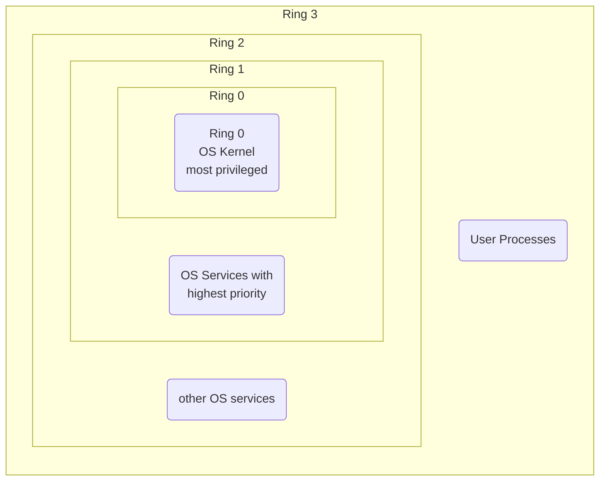

# Windows Memory Management 1

[[Memory Management]] is a component residing in the [[Windows executive|Executive Layer]]. 

## Physical Memory

![[Pasted image 20231022155830.png]]

See here [[physical memory]] with $2^4$ addressable bytes. The data-bus is used to transfer bytes from inside the [[physical memory]] to other parts of the PC. The address space that a 32-bit processor can address it its *address bus* is roughly $4$ Gigabytes ($2^{32}$ bytes). This address space is *flat*, meaning it is not differentiated.

## Segmentation of Memory

How does one separate the [[Kernel Address Space]] from the [[User Application Space]]? There are two levels to consider:

1. Code (e.g. instructions) whose code ([[User Application Space|UAS]] or [[Kernel Address Space|KAS]]) could execute certain machine instructions and whose code may access which parts of [[physical memory]] or other hardware access (IO).
2. Data (e.g. memory architecture) which data is dedicated solely to the [[Kernel]] or which data is accessible to [[User Application Space|UAS]].

A very simple method to *differentiate memory* is by using a few bits additionally to the address bits:

- for memory usage 
- for memory access by code 


## [[Segment]]

> [!Definition]
> A [[Segment]] is a region inside [[physical memory]]. We can define "Segments" in order to separate Code and Data.
> 
> ```mermaid
> flowchart LR
> e1(Segment Address, \npoints to some start of a segment)
> e2{+}
> e3(offset)
> e4(Address, \npoints to a certain address \nin physical memory)
> 
> e1 --> e2
> e3 --> e2
> e2 --> e4
> ```

## [[Central Processing Unit]] ([[Central Processing Unit|CPU]])

Also called *[[Central Processing Unit|Von Neumann Architecture]]* for a multi-user, interactive and connected system.

![[Pasted image 20231022162408.png]]

## Ring Mechanism 

The x86-architecture introduces so-called *privilege levels* to support memory protection.



The Ring Mechanism lets the [[Operating System|OS]] and [[Central Processing Unit|CPU]] collaborate to realize memory segmentation. At any given time, an x86 [[Central Processing Unit|CPU]] is running in a specific *privilege level*, which determines what code can and cannot do. Most modern x86 [[Kernel|Kernels]] use only two privilege level (0 and 3). The [[Central Processing Unit|CPU]] privilege level is just related to the [[physical memory]] and has nothing to do with [[Operating System|OS]] users, whether root, admin, guest or regular user. 
All [[Kernel]] code runs in ring 0, regardless of the user on whose behalf the code operates. All user code runs in ring 3, regardless of the [[Operating System|OS]] user on whose behalf the code operates. 
Due to restricted access to memory and IO ports, [[User Application Space|User mode]] can do almost nothing to the outside without calling on the [[Kernel]]. It can't open files or send network packets or print the screen or allocate memory. All the *data structures* that control these tasks cannot be touched directly by user code so actually a user [[Process]] is running inside a *sandbox*, run by the [[Operating System|OS]] [[Kernel]]. The [[Kernel]] *starts* and later *tears down* the individual sandbox for each user [[Process]]. 

> [!Info]
> This is why [[Windows]] 95 and 98 crashed so much, because important data structures were left accessible to [[User Application Space|User mode]] for compatibility reasons.

