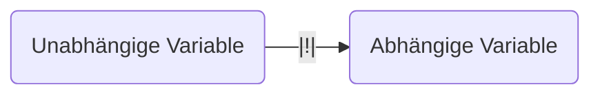

# Wissenschaftliches Arbeiten

# [[Argumentieren]]

Erkenntnisse werden aufgrund von persönlichen Erfahrungen gebildet. Diese persönlichen Erfahrungen können

- lückenhaft
- unsystematisch
- zufallsbehaftet und 
- als Erinnerung gespeichert und damit verzerrt

sein. Folge: Persönliche Erfahrungen sind oft Vermutungen, persönliche Meinungen und unbelegte Behauptungen. 

Um persönliche Vermutungen, Meinungen und unbelegte Behauptungen zu stützen, werden bewusst oder unbewusst typische Strategien genutzt:

- [[Überzeugungsstrategie]]
- [[Berufung Auf Autoritäten]]
- [[Einzelbeispiele Als Beleg]]
- [[Fake News Strategie]]

## [[Überzeugungsstrategie]]

Die RednerIn zeigt sich überzeugt von einer Antwort. Das Problem dabei ist, dass kein Hinweis auf Korrektheit oder Fehlerhaftigkeit einer Aussage existiert.

> [!Example]  
> "Ich bin absolut davon überzeugt, dass Homöopathie wirkt!"

## [[Berufung Auf Autoritäten]]

Die RednerIn beruft sich auf Autoritäten, die sich mit dem Thema befasst haben (sollen). Bezug auf eine Einzelperson ist aber kein ausreichender Beleg für die Richtigkeit.

> [!Example]  
> "Es gibt eine bekannte Studie, des Ernährungsphysiologen Gustav von Bunge, die beweist, das Spinat extrem viel Eisen enthält!"

## [[Einzelbeispiele Als Beleg]]

RednerIn nennt Einzelbeispiele, um Behauptungen zu belegen. Jedoch sind Einzelbeispiele kein Beweis für eine Generalisierbarkeit.

> [!Example]  
> "Ich weiß, dass Elefanten weiß sind. Mir ist persönlich einmal ein weißer Elefant über den Weg gelaufen!"
> 
> ![[Pasted image 20240312080849.png]]

## [[Fake News Strategie]]

Die RednerIn bezeichnet bewiesene Argumente als Lüge, ohne Beweis für die eigene Behauptung vorzulegen. Die Aussage kann nicht überprüft werden; der Verdacht einer Lüge steht aber im Raum.

> [!Example]  
> "Fake News!"

Politfact-Faktencheck zu Trump

| Kategorie       | Anzahl | Anteil |
| --------------- | ------ | ------ |
| True            | 35     | 3%     |
| Mostly True     | 84     | 9%     |
| Half True       | 119    | 13%    |
| Mostly False    | 186    | 20%    |
| False           | 330    | 36%    |
| "Pants on Fire" | 146    | 16%    |

# [[Wissen]]

[[Wissen]] ist die Kenntnis über den in einem Fachgebiet zu gegebener Zeit bestehenden Konsens, vor allem bezüglich einer gültigen Terminologie erlaubter Interpretationen, bestehender Zusammenhänge und Gesetzmäßigkeiten, empfehlenswerter Methoden und Handlungen. 

# [[Wissenschaft]]

Wissenshaft ist die organisierte Form der Sammlung und Auswertung von Daten. Ziel ist die

- Generierung zuverlässiger und gültiger Erkenntnisse
- Verdichtung zu gesichertem [[Wissen]]

Das Vorgehen sieht wie folgt aus:

- Einsatz wissenschaftlicher Methoden
- Erprobt durch über Jahrhunderte kontinuierliche verbessertes Erfahrungswissen
- Berücksichtigung wissenschaftlicher [[Qualitätskriterien]]

![[Pasted image 20240312081238.png]]

# [[Methodik]]

[[Wissenschaft|Wissenschaftliche]] Forschungsmethoden sind Vorgehensweisen zur systematischen Sammlung und Auswertung von Daten. Ziel ist die Bildung wissenschaftlicher Theorien in Relation zu existierenden wissenschaftlichen Erkenntnissen. Die [[Methodik]] ist ein festgelegter, erprobter Prozess und damit transparent und nachvollziehbar, um die Überprüfung, Diskussion un Kritik durch unabhängig Dritte möglich zu machen.

- [[Induktion]]
- [[Deduktion]]
- [[Kombiniertes Vorgehen]]
- [[Quantitative Methoden]]
- [[Qualitative Methoden]]

## [[Induktion]]

[[Induktion]] ist die Wiederholte Beobachtung oder sorgfältige Einzelfallanalysen werden auf Regel verallgemeinert. 

| Vorteil                                | Nachteil                         |
| -------------------------------------- | -------------------------------- |
| Identifikation neuer Regelhaftigkeiten | Nur Wahrscheinlichkeitscharakter |
| Generierung neuer Hypothesen           | Nicht beweisbar                  |

Hier muss zu Alltagsstrategie von Einzelbeispielen abgegrenzt werden. Der Erkenntnisprozess muss transparent dargestellt werden. 

![[Pasted image 20240312082113.png]]

## [[Deduktion]]

Ist die Ableitung einer *Hypothese* aus einer vorhandenen Theorie. Diese Theorie kann eine Annahme oder bereits abgesichert sein. Die Hypothese wird auf Gültigkeit getestet. Stimmt diese, wird die Theorie weiter abgesichert; falls nicht, muss die Theorie revidiert werden oder ist vollständig widerlegt.

| Vorteil                                       | Nachteil                                             |
| --------------------------------------------- | ---------------------------------------------------- |
| Theorie kann verbessert und verfeinert werden | Theorie wird nie "bewiesen", sondern nur abgesichert |

![[Pasted image 20240312082233.png]]

## [[Kombiniertes Vorgehen]]

![[Pasted image 20240312082248.png]]

## [[Quantitative Methoden]]

Ziel ist es, dass Theorie deduktiv abgesichert werden. Merkmalsausprägungen oder kausale Zusammenhänge sollen gemessen werden. Voraussetzung dafür ist eine **große Stichprobe** und **konkrete Variablen**. Zum Beispiel

- Korrelationsstudien
- Experimente
- standartisierte Tests
- standartisierte (!) Fragebögen
- inferenzstatistische Methoden

## [[Qualitative Methoden]]

Ziel ist es, einen ersten Zugang zu neuen Themengebieten, ein tieferes Verständnis für Sachverhalte zu entwickeln, eventuell Muster zu erkennen und Hypotheses und Theorien zu entwickeln.

# [[Qualitätskriterien]]

![[Pasted image 20240312082343.png]]

An dieser Stelle sollen einige der wichtigsten [[Qualitätskriterien]] einmal genannt werden: 

- [[Objektivität]]
- [[Überprüfbarkeit]]
- [[Reliabilität]]
- [[Validität]]

## [[Objektivität]]

Ergebnisse sind immer gleich, unabhängig davon, wer eine [[Wissenschaft|wissenschaftliche]] Arbeit durchführt. Sie sind unabhängig. [[Objektivität]] erfordert

- unvoreingenommenes wissenschaftliches Vorgehen
- Selbstkontrolle
- sachliche Argumentation
- Neutrale und vorurteilsfreie Darstellung

Interessenkonflikte werden offen gelegt, wie

- Wer finanziert eine [[Wissenschaft|wissenschaftliche]] Arbeit?
- Zu wem steht ein Wissenschaftler in einem Abhängigkeitsverhältnis?

## [[Überprüfbarkeit]]

[[Wissenschaft|Wissenschaftliche]] Aussagen müssen [[Überprüfbarkeit|überprüfbar]] sein:

- Falsche Aussagen müssen von Dritten ggf. widerlegt (falsifiziert) werden können.
- Richtige Aussagen müssen von dritten ggf. bestätigt (verifiziert) werden können.
- Was verifiziert werden kann, gilt als "*vorläufig* gesichert".
- Was falsifiziert werden kann, gilt als falsch.
- Was mangels [[Überprüfbarkeit]] nicht verifiziert oder falsifiziert werden kann, hat keine [[Wissenschaft|wissenschaftliche]] Relevanz.

## [[Reliabilität]]

Eine [[Wissenschaft|wissenschaftliche]] Studie sollte bei wiederholter Untersuchung zuverlässig die gleichen Ergebnisse produzieren (Reproduzierbarkeit)

- Interrater-[[Reliabilität]]: Andere Forscher = gleiches Ergebnis 
- Retest-[[Reliabilität]]: Erneute Messung = gleiches Ergebnis 
- Paralleltest-[[Reliabilität]]: Mehrere Messinstrumente = gleiches Ergebnis 
- Split-Half-[[Reliabilität]]: Versuch in zwei Hälften geteilt = gleiches Ergebnis 
- Interner Konsistenz-[[Reliabilität]]: Teil des Instruments = gleiches Ergebnis

## [[Validität]]

Eine [[Wissenschaft|wissenschaftliche]] Studie ist [[Validität|valide]], wenn das gemessen wird, was gemessen werden soll und wenn die Daten auch tatsächlich die Frage beantworten.

- Interne [[Validität]]: Können aus den Daten kausale Schlüsse gezogen werden?
- Externe [[Validität]]: Sind die Ergebnisse auch auf andere Situationen außerhalb der Studie übertragbar.

# [[Wissenschaftliches Fehlverhalten]]

Wissenschaftsbetrug ist [[Wissenschaftliches Fehlverhalten]] in *betrügerischer Absicht*.  
Einige Beispiele von [[Wissenschaftliches Fehlverhalten|Wissenschaftlichem Fehlverhalten]] können sein:

- Unwahre Behauptungen
- Erfundene Forschungsergebnisse
- Gefälschte Forschungsergebnisse
- Fehlende [[Überprüfbarkeit]]
- [[Plagiat]]
	- [[KI-Basierte Textgeneratoren]]
	- [[Ghost Writing]]
- Academic Paper Mill

## [[Plagiat]]

Ein [[Plagiat]] könnte die ungekennzeichnete Kopie ganzer Sätze und Textpassagen, Fehlende Quellangaben sowie Mängel beim Zitieren sein.  
Abhilfe kann geschaffen werden durch die Angabe **aller** [[Quellen]] und Hilfsmittel sowie auch die Angabe von Textgeneratoren.

## [[KI-Basierte Textgeneratoren]]

Die Erzeugung von Textpassagen, Bildmaterial, Code-Snippets und / oder anderen Inhalten durch KI-basierte Generatoren kann als [[Plagiat]] gewertet werden.  
Manche BetreuerInnen erlauben den Einsatz von KI-Tools. Es gilt aber immer

- Einsatz nachweisen
- [[Quellen|Quelle]] angeben
- Prompt und Antwort angeben

## [[Ghost Writing]]

[[Ghost Writing]] ist die Erzeugung von Textpassagen, Bildmaterial und / oder anderen Inhalten durch andere Personen als die angegebenen AutorInnen. 

# [[Quellen]]

Eine [[Quellen|Quelle]] muss [[Zitierfähig]] und [[Zitierwürdig]] sein.

> [!Definition]  
> [[Zitierfähig|Zitierfähigkeit]] ist jede [[Quellen|Quelle]], die eindeutig identifiziert, verortet, zugänglich und in der zitierten Fassung dauerhaft ist.

- Eindeutigkeit → Über Autor, Titel und ergänzende Angaben eindeutig identifiziert. 
- Verortbarkeit → Standort über Literaturkatalog bekannt oder über Internetadresse angegeben 
- Zugänglichkeit → Kann auch durch Dritte beschafft werden 
- Dauerhaftigkeit → Ist auch zukünftig verfügbar

> [!Definition]  
> Eine [[Quellen|Quelle]] ist [[Zitierwürdig]], wenn sie wissenschaftlichen Qualitätsansprüchen genügt oder wenn der Erkenntnisgewinn der Arbeit mit wissenschaftlichen [[Quellen]] realisiert werden kann.  
> Nicht [[Zitierwürdig]] = nicht verwenden

Einige typische Kriterien für [[Zitierwürdig|Zitierwürdige]] [[Quellen]] sind:

- Wissenschaftlicher Fachautor 
- Wissenschaftliches Forschungsgebiet in dem der Fachautor arbeitet 
- Wissenschaftliches Publikationsorgan (z.B. wiss. Fachzeitschrift, wiss. Konferenzbeiträge, wiss. Fachbuch,..) 
- [[Wissenschaft|Wissenschaftliche]] Datenbank listet die [[Quellen|Quelle]] 
- Wissenschaftlicher Aussagewert der [[Quellen|Quelle]] 
- [[Wissenschaft|Wissenschaftliche]] [[Qualitätskriterien]] werden berücksichtig (siehe oben) 
- Wissenschaftlicher Umgang mit Quellenverweisen

## Wo Sollte Ich Recherchieren?

Einige Möglichkeiten sind

- Bibliotheken
- Fachzeitschriften
- Fernleihe

[Ostfalia - Literatur finden](https://www.ostfalia.de/cms/de/bib/literatur_finden/)

| Datenbank                          | Verfügbar über                                                           | Anmerkung                                                |
| ---------------------------------- | ------------------------------------------------------------------------ | -------------------------------------------------------- |
| Google Scholar                     | [Google Scholar](https://scholar.google.de/)                             | Vorsicht: Keine Qualitätsprüfung der gelisteten [[Quellen]]! |
| Research Gate                      | [ResearchGate \| Find and share research](https://www.researchgate.net/) |                                                          |
| IEEE Xplore                        | [IEEE Xplore](https://ieeexplore.ieee.org/Xplore/home.jsp)               | FH-Intranet / VPN oder Login                             |
| Association for computer machinery | [ACM Digital Library](https://dl.acm.org/)                               | FH-Intranet / VPN                                        |
| dblp computer science bibliography | [dblp: computer science bibliography](https://dblp.org/)                 |                                                          |

## Wie Soll Ich Recherchieren?

1. Führen Sie eine Stichwortsuche in Literaturdatenbanken durch
2. Filtern Sie schrittweise die Ergebnisliste Ihrer Suche
3. Entscheiden Sie in jedem Schritt ob eine Publikation relevant ist
4. Weitere Literatur identifizieren, indem Sie die [[Quellen]] die die aktuelle Publikation zitiert oder [[Quellen]] die Ihre Publikation zitieren lesen.

![[Pasted image 20240312084104.png]]

## Wie Gebe Ich [[Quellen]] Richtig An?

Der Zitationsstil ist abhängig von der wissenschaftlicher Disziplin. Die Guidelines für jeden wissenschaftlichen Zitationsstil ist im [[Internet]] suchbar. Informatik verwendet in der Regel "IEEE". 