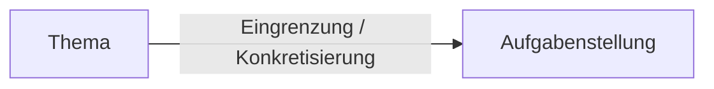

# Writing Lab - Exposé Und Gliederung

## [[Schreibprozess]]

Hier abbildung für Schreibprozessmodell

## [[Exposé]]

In einem [[Exposé]] geht es darum, die Planung und Konzeption eines wissenscahftlichen Schreibprojekts festzuhalten. Es gibt z.B. Aufschluss über das anvisierte Theme, die Fragestellung, Zielsetzung, Vorgehensweise, Daten- und Literaturgrundlage. Funktionen sind:

- eigene Orientierungshilfe bzgl. inhaltliche und zeitliche Realisierbarkeit / Umsetzbarkeit, disziplinäre Angemessenheit
- Nachvollziehbarkeit für andere Personen

> [!Info]  
> Das [[Exposé]] ist ein Zwischenschritt von der Idee zum Text. Es soll von vornherein Weichen stellen und kann Irrwege oder Rückschritte im [[Schreibprozess]] verhindern!

Hier Abbildung Bestandteile des Exposes im Seminar

### Zur Entwicklung Einer Aufgabenstellung

Die Aufgabenstellung gibt den konkreten Arbeitsauftrag vor und bildet den Roten Faden Ihrer Arbeit. **Größere Änderungen der Aufgabenstellung sollten sie immer mit Ihren Fachlehrenden absprechen.**

>[!Tip]
>Hier Tipps aus den Folien

[Dreischritt](https://moodle.ostfalia.de/pluginfile.php/673621/mod_page/content/18/Dreischritt.docx?time=1710507421924)
[Eingrenzungstabelle](https://moodle.ostfalia.de/pluginfile.php/673621/mod_page/content/18/Eingrenzungstabelle.docx?time=1710507430403)

## [[Gliederung]]

Der Aufbau einer wissenschaftlichen Arbeit sieht wie folgt aus:

- Inhaltsverzeichnis
- ggf. weitere Verzeichnisse
- Einleitung
- Hauptteil
- Schluss
- Literaturverzeichnis
- Anhan
- Eidesstattliche Erklärung

[Einleitung](https://moodle.ostfalia.de/pluginfile.php/673621/mod_page/content/18/Einleitung.docx?time=1710507440539)
[Fazit](https://moodle.ostfalia.de/pluginfile.php/673621/mod_page/content/18/Fazit.docx?time=1710507458803)

Ein erster Gliederungsentwurf gibt Orientierung über den Umfang der Arbeit, dient als Gesprächsgrundlage mit Prüfenden und hilft beim Ordnen und Strukturieren von Gedanken und Ideen. Dieser muss anfangs nicht perfekt sein und ist nicht in Stein gemeißelt!

[Gliederung entwickeln](https://moodle.ostfalia.de/pluginfile.php/673621/mod_page/content/18/Gliederung%20entwickeln.docx?time=1710507467172)

