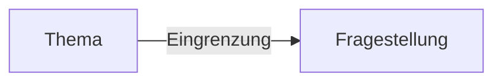

# Writing Lab - [[Themenfindung]] Und Literaturrecherche

## Ein Thema Entwickeln

|                            | Thema ist vorgeben, z.B. Vorgaben durch Dozierende / abhängig von deren Fachexpertisen          | Thema selbst entwickeln                                                 |
| -------------------------- | ----------------------------------------------------------------------------------------------- | ----------------------------------------------------------------------- |
| Vorteile                   | Thema ist angemessen für den Veranstaltungs- und Prüfungskontext                                | Thema nach meinen persönlichen (fachlichen) Interessen gestalten können |
|                            | MeinE BetreuerIn kennt sich mit dem Thema aus und kann mich fachlich beraten                    | Das Schreiben kann leichter fallen                                      |
|                            |                                                                                                 | Ich habe ggf. schon Anknüpfungspunkte, die ich nutzen kann.             |
| Mögliche Herausforderungen | Liegt mir das Thema?                                                                            | Welches Thema eignet sich überhaupt für eine Hausarbeit?                |
|                            | Wie viel Vorwissen habe ich dazu?                                                               | Ist das Thema zu groß / klein?                                          |
|                            | Habe ich einen Bezug zu dem Thema, d.h. kann ich mir grundsätzlich was zu dem Thema vorstellen? | MeinE BetreuerIn kann mich evtl. fachlich nicht zu 100% unterstützen    |
|                            |                                                                                                 | ggf. Voreingenommenheit                                                 |

Im Fall des Seminars, ist das Oberthema vorgegeben, aber das genaue Thema ist in einem Rahmen freier wählbar.

## Warum Ist Es Wichtig, Ein Wissenschaftliches Thema Einzugrenzen?

Häufig werden die Themen zu weit gefasst. Daher ist eine Eingrenzung notwendig, um ein Thema bearbeitbar zu machen. 

> [!Info]  
> Eine Eingrenzung ist die Festlegung von Aspekten und Schwepunkten, die in der Arbeit bearbeitet werden sollen, und ggf. Ausgrenzungen, was *nicht* behandelt ist. 

Hier fehlt noch was.

Die Eingrenzung des Themas ist ggf. abhängig von

- Ihrem *Erkenntnisinteresse* (Relevanz für ein Fachpublikum)
- den gegebenen *Rahmenbedingungen* (Umfang, Bearbeitungszeit)
- Vorgaben durch *Prüfende* (Anforderungen und Ansprüche)
- der *Literatur- / Materialgrundlage*

> [!Example]  
> Thore: "Ich möchte über Personalbeschaffung schreiben."  
> Professorin: "**Das ist doch viel zu allgemein.**"
> *Thore besucht daraufhin die Schreibberatung und berichtet, dass er Unterstützung beim Eingrenzen seines Themas braucht…*
> **Warum interessiert dich denn das Thema?**
> „Aufgrund des Fachkräftemangels […]“ 
> **Wen genau meinst du mit „den Fachkräften“?**
> „Hm… ich glaube ich würde vor allem die Generation Z in den Blick nehmen, weil diese Generation gerade auf den Arbeitsmarkt strömt und für ArbeitgeberInnen eine besonders interessante Zielgruppe darstellt.“ 
> **Worauf soll der Schwerpunkt liegen? Hast zum Beispiel vor, eine konkrete Beschaffungsmaßnahme zu untersuchen?**
> „Eine Idee wäre das Employer Branding, also dass Arbeitgebende versuchen, sich als Marke zu präsentieren und sich dadurch von anderen Arbeitgebenden abzuheben.“ 
> **Was findest du daran interessant?** 
> „Ich könnte herausfinden, ob ein besseres Employer Branding ArbeitgeberInnen hilft, Fachkräfte zu gewinnen.“ 
> **Möchtest du dich z. B. auf bestimmte Firmen/ Branchen konzentrieren?**
> „Das weiß ich noch nicht genau. Erstmal nicht, weil mich vor allem das Konzept interessiert. Aber das könnte eine Option sein, das Thema später noch weiter einzugrenzen. […] Vielen Dank!“

## Eingrenzungsmöglichkeiten

- zeitlich Eingrenzen
- räumlich Eingrenzen
- auf bestimmte Personen / Personengruppen beschränken
- Auswahl von zu untersuchenden Aspekten treffen
- Schwerpunkt setzen
- eine bestimmte Forschungsmethode nutzen
- am Beispiel von...
- nach konkreten theoretischen Ansätzen / AutorInnen
- Auswahl an [[Quellen]] / Materialien
- beschränkt auf einen bestimmten fachlichen Blickwinkel / Teildisziplin

# Sonstiges

- [Eingrenzungstabelle](https://moodle.ostfalia.de/pluginfile.php/673621/mod_page/content/18/Eingrenzungstabelle.docx?time=1710507430403) 

# [[Literaturrecherche]]

Anfangs ist es vor allem wichtig, einen Überblick über die Thematik zu verschaffen. Dann nach konkreten aktuellen Themenaspekten Ausschau halten, um das Thema weiter einzugrenzen. Stellt sich an der Stelle nun die Frage:

1. Wo können Sie nach diesen Texten suchen?
2. Welche Textsorten sind dafür besonders geeignet?

[[Quellen]]

## Lesephasen

Je konkreter die Zielsetzung, bzw. der Leseauftrag, desto höher ist auch die "Ausbeute". 

| Vorbereitung                      | Während des Lesens                          | Nachbereitung                                    |
| --------------------------------- | ------------------------------------------- | ------------------------------------------------ |
| Texte suchen und auswählen        | Markieren / Unterstreichen                  | Rekapitulieren                                   |
| Eignung prüfen                    | Begriffe klären, ggf. Glossar anlegen       | Leseergebnis dokumentieren                       |
| Erwartungen formulieren           | Argumentation rekapitulieren                | Vorher gestellte Fragen beantworten              |
| Fragen an den Text stellen        | Darstellungsgang eruieren                   | Behaltensleistung prüfen                         |
| [[Information|Informationen]] über Kontext suchen | Kernelemente isolieren                      | Gelesenes mit anderen Texten in Beziehung setzen |
| Zeitrahmen abstecken              | Zusammenfassung schreiben                   | Text zusammenfassen                              |
| Motivation prüfen                 | Graphische Veranschaulichungen nutzen       | Kritische Einschätzung schreiben                 |
| Lesesituation gestalten           | Sekundärliteratur einsetzen                 | Test reflektieren                                |
|                                   | Wörterbuch / Lexika nutzen                  | [[Kommunikation]] über Text                          |
|                                   | Lesefortschritt und Zielorientierung prüfen | Integration in den eigenen Text                  |

## Crap-Test

![[Pasted image 20240325140903.png]]

In Fachdatenbanken finden sich i.d.R. nur wissenscahftliche Texte, die nicht mit dem CRAP-Test überprüft werden müssen. **Bei der Suche mit anderen Suchmaschinen muss die Seriösität i.d.R. überprüft werden!**

Für nicht primär [[Wissenschaft|wissenschaftliche]] [[Quellen]] kann zusätzlich die Frage des Verwendungszweck hinzugefügt werden. Also "Wofür möchte ich die [[Quellen|Quelle]] nutzen?"

# Eine [[Fragestellung]] entwickeln

Eine [[Fragestellung]] definiert das Ziel und den Arbeitsauftrag der [[Seminararbeit]]. Sie gibt Orientierung:

- Was ist der Fokus der Arbeit?
- Wie muss die Arbeit aufgebaut werden?
- Welche [[Quellen]] sind relevant?
- Wie umfangreich wird die Arbeit?

|               | Aufgabenstellung ist vorgegeben                | Seminararbeit                                                                                                           |
| ------------- | ---------------------------------------------- | ----------------------------------------------------------------------------------------------------------------------- |
| Fragestellung | ist vorgegeben                                 | muss erarbeitet werden                                                                                                  |
| Ziel          | Lösung erstellen                               | Auseinandersetzung mit einer für InformatikerInnen relevanten Frage oder Problemstellung ohne konkreten Anwendungsbezug |
| Aufbau        | ggf. Arbeitsschritte sind definiert            | muss eigenständig erarbeitet werden                                                                                     |
| Ergebnis      | Aufgabe bearbeiten und Präsentieren der Lösung | eigenständige Ausarbeitung zum Thema mit Beantwortung der Fragestellung                                                 |
|               |                                                |                                                                                                                         |
